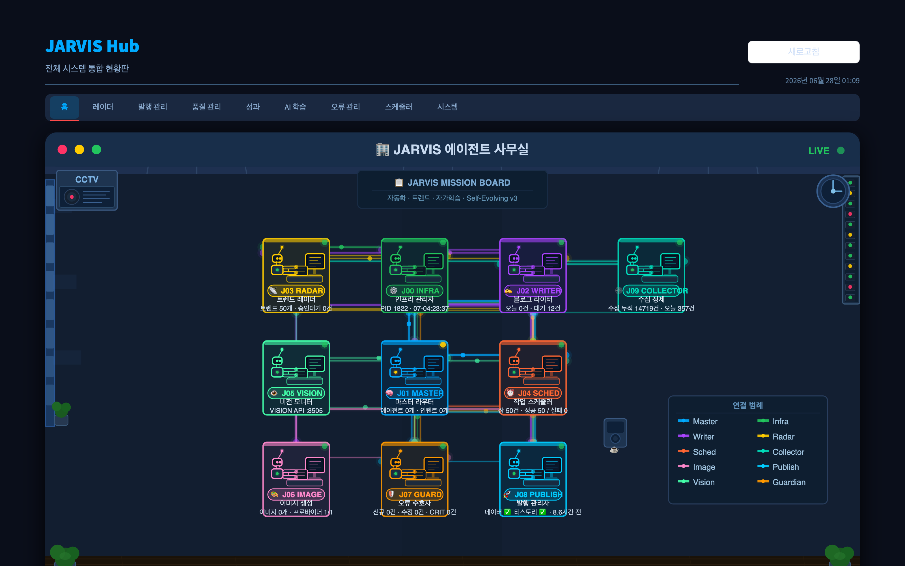
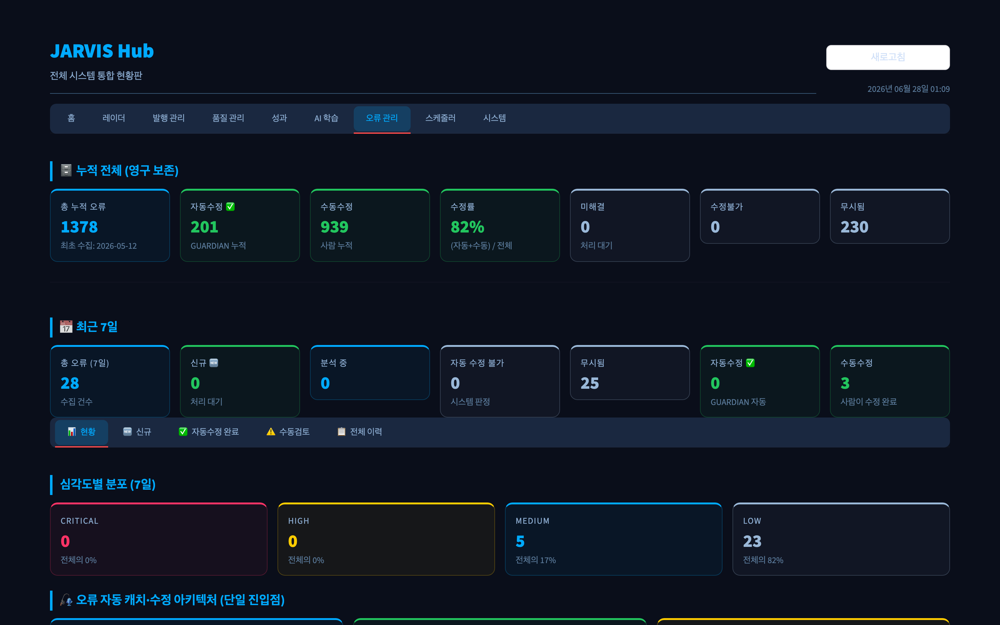
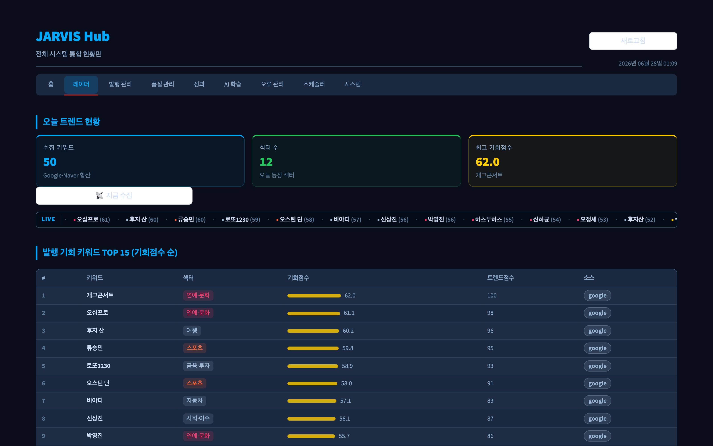
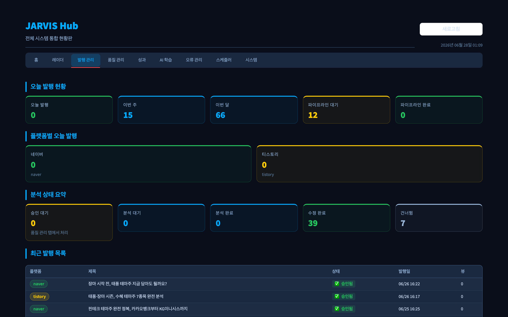
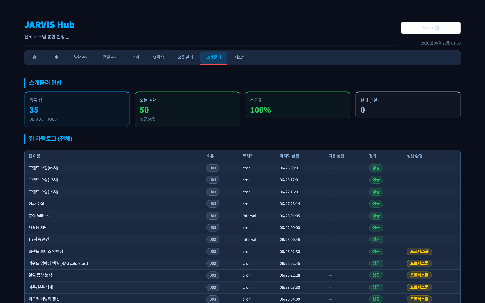
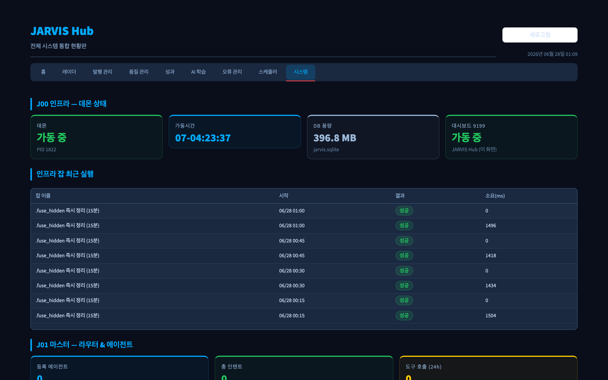
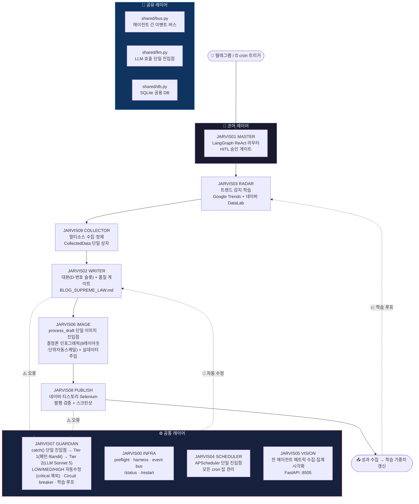
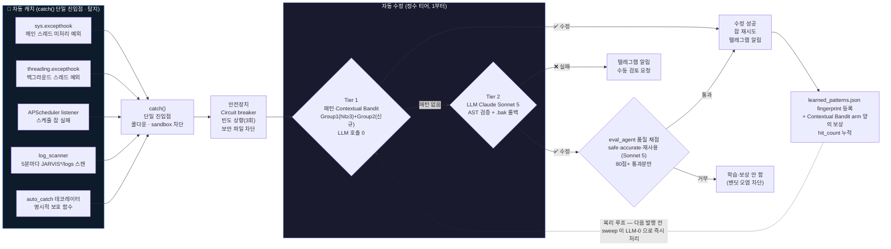

<div align="center">

# 🤖 JARVIS Agent

**트렌드 감지 → 수집 → 글 생성 → 이미지 → 발행 → 자가학습까지 스스로 도는 10-모듈 멀티에이전트 시스템**

[](https://python.org)
[](https://anthropic.com)
[](https://langchain-ai.github.io/langgraph/)
[](https://selenium.dev)
[](https://apscheduler.readthedocs.io)
[](https://en.wikipedia.org/wiki/Multi-armed_bandit)
[](https://streamlit.io)
[](https://sqlite.org)
[](#-팀--역할)
[](https://apple.com/macos)

> 텔레그램으로 명령하면 알아서 글을 쓰고, 이미지를 만들고, 발행하고, 오류가 나면 스스로 고칩니다.

<br>



<sub>▲ <b>JARVIS Hub 통합 대시보드</b> (<code>localhost:9199</code>) — 10개 에이전트(JARVIS00~09)의 실시간 상태·상호 연결·메트릭을 한 화면에. 데몬 기동 시 자동 실행.</sub>

</div>

---

## 📊 프로젝트 수치

<div align="center">

| 🗂️ 에이전트 모듈 | 📝 Python 코드 | 📄 파일 수 | 🔧 등록 도구 | 🛡️ 정책 검증 항목 | 🧠 누적 오류 자동처리 |
|:-:|:-:|:-:|:-:|:-:|:-:|
| **10개** | **79,200+ LOC** | **190개** | **24개** | **46종** | **1,960+건 · 해결률 88%**<br><sub>(2026-07-05 기준)</sub> |

</div>

---

## 🖥️ 웹 대시보드 — 실시간 시연

**▶ 로컬 실행 주소: [`http://localhost:9199`](http://localhost:9199)**

`python jarvis_daemon.py` 한 줄이면 데몬과 함께 Streamlit 통합 현황판(`hub.py` — 대시보드 단일 진입점)이 자동으로 떠오릅니다. 발행·트렌드·품질·성과·AI 학습·오류·스케줄·시스템을 **9개 탭** 한 화면에서 실시간 모니터링합니다.

<table>
  <tr>
    <td width="50%" align="center" valign="top">
      <br>
      <sub><b>🛡️ 오류 자동 캐치·수정</b><br>catch() 단일 진입점 → 2-Tier 자동 복구 · 누적 1,960건 · 자동+수동 해결률 88% (2026-07-04 기준)</sub>
    </td>
    <td width="50%" align="center" valign="top">
      <br>
      <sub><b>📡 트렌드 레이더</b><br>Google·Naver 50개 키워드 실시간 수집 + 발행 기회점수 TOP 15</sub>
    </td>
  </tr>
  <tr>
    <td align="center" valign="top">
      <br>
      <sub><b>📝 발행 관리</b><br>네이버·티스토리 발행 이력·파이프라인·품질 분석 (이번 달 66건)</sub>
    </td>
    <td align="center" valign="top">
      <br>
      <sub><b>🗓️ 스케줄러</b><br>cron/interval 39개 잡 단일 진입점 · 오늘 50건 실행 · 성공률 100%</sub>
    </td>
  </tr>
  <tr>
    <td align="center" valign="top" colspan="2">
      <br>
      <sub><b>⚙️ 시스템</b> — 데몬 가동 상태 · DB 용량 · 10개 에이전트별 잡 실행 이력</sub>
    </td>
  </tr>
</table>

---

## ✨ 핵심 기능

| 기능 | 설명 |
|------|------|
| 📝 **블로그 자동 발행** | 경제 브리핑(매일 06:30) + 테마주 분석(매일 16:00) — 네이버·티스토리 동시 발행 |
| 🔗 **통합 콘텐츠 파이프라인 (★ 2026-07-05)** | 경제·테마·미래 카테고리가 **하나의 공통 경로** — J09 `CollectedData` 단일 상자 → J02 대본(D-번호 슬롯) → **J06 `process_draft` 단일 이미지 진입점**(실패차트→AI사진·최소 5장 보장·썸네일 필수) → J08 |
| 🔎 **발행 전 품질 게이트** | 발행 *전* harness Layer 3 에서 사실성(출처 대조 + 웹 재검증)·유익성·매력도를 LLM(Sonnet 5)으로 검수 → 미달 시 통과할 때까지 재작성 (결함은 절대 송출 안 됨) ★ 2026-06-28 |
| 🖼️ **인포그래픽 엔진 (★ 2026-07-11 다양성 복원)** | **결정론 코드 템플릿 8가지** × 매일 새 팔레트 = 글마다 다른 인포그래픽. 차트 수치는 **D-번호 슬롯**으로 JARVIS09 실데이터 직접 주입(LLM 수치 날조 구조적 차단). **단위 자동 스케일**(`_auto_scale`: 백만원→조원/억원) |
| 📡 **트렌드 레이더** | Google Trends + 네이버 DataLab 실시간 수집 → 핫 키워드 자동 탐지 |
| 🛡️ **자동 캐치·수정 시스템** | `catch()` 단일 진입점 → Tier 1(패턴·Contextual Bandit) → Tier 2(LLM Sonnet 5) — LOW/MED/HIGH 자동 복구 (CRITICAL은 패턴만 + 수동 검토) |
| 🔒 **보안 전문가급 안전장치** | Circuit breaker · 빈도 기반 severity 자동 상향(3회) · 보안 파일 수정 절대 금지 |
| 🏛️ **헌법형 거버넌스** | `precommit_check.py` 1,123줄 — 45종 정책을 pre-commit 훅·주간 감사로 강제 (+ 데몬 부팅은 `preflight.py` 검증) |
| 📊 **통합 대시보드** | hub.py 단일 진입점(port 9199) — 발행 이력·오류 현황·학습 곡선 한눈에 |
| 💬 **텔레그램 인터페이스** | 자유 문장 → ReAct 라우터 → 에이전트 디스패치 + 인라인 버튼 HITL 승인 |

---

## 🆕 최근 주요 업데이트 (2026-06-29 ~ 07-11)

| 영역 | 변경 | 근거 |
|------|------|------|
| **★ 차트 실데이터 강제 — D-번호 슬롯 (2026-07-11)** | LLM이 차트 슬롯에 직접 수치를 쓰던 구조를 **완전 폐기**. LLM은 `D1 · 제목`만 작성하고, JARVIS가 `collected.datasets`에서 D-번호 인덱스로 실데이터를 주입(`slot_renderer.py`). Jaccard 제목 매칭은 보조 폴백. LLM이 수치를 쓸 수 있는 경로 구조적 차단 → **수치 날조 근본 원인 제거** (ERRORS [421]) | ERRORS [421] |
| **★ 인포그래픽 단위 자동 스케일 (2026-07-11)** | 차트에 9자리 숫자(예: `23,491,406백만원`)가 그대로 나타나던 문제 해결. `_auto_scale(val, unit)` — 백만원 ≥ 1조 → 조원, ≥ 100억 → 억원; 원 → 조/억/만원 자동 변환. `_scale_rows_uniform()` 으로 데이터셋 전체를 균일 단위로 일괄 변환 (막대·꺾은선·히어로 통계·미니카드 동일 단위) | pro_templates.py |
| **★ 인포그래픽 레이아웃 다양성 복원 (2026-07-11)** | `design_recipes.json` 에 구조 레이아웃 템플릿 8개가 있었지만 실제로 하나도 안 쓰이던 버그 수정. 원인: `build_html()` 의 `_n_ds >= 2` 조건이 슬롯이 항상 1개 전달로 절대 True가 안 됨 → `>= 1` 로 수정해 **8가지 HTML 구조 레이아웃** 즉시 활성화. Playwright CSS `card:empty{display:none}` 으로 빈 카드 슬롯 자동 숨김 | pro_templates.py |
| **★ Phase2 레시피 레이아웃 포함 (2026-07-11)** | 매일 새벽 05:00 생성되는 Phase2(결정론) 레시피가 색상 팔레트만 갖고 레이아웃은 없었음. 수정: `_generate_recipe_deterministic()` 이 기존 레지스트리에서 무작위로 레이아웃 템플릿을 골라 배정 → **색상 × 레이아웃 독립 조합**으로 경우의 수 대폭 증가 | design_learner.py |
| **★ 차트 클리핑 수정 (2026-07-11)** | ① 막대차트 오른쪽 숫자 잘림 — `barMax = W-300 → W-420` (오른쪽 여백 240px 확보). ② 꺾은선 Y축 라벨 왼쪽 넘침 — `xL = 84 → 120` (9자리 숫자도 안전). 단위 자동 스케일로 긴 숫자 자체도 줄어듦 | pro_templates.py |
| **★ KRX 시장 거래대금 데이터 (2026-07-11)** | KOSPI·KOSDAQ 일평균 거래대금 수집 추가 — `krx_provider.collect_market_trading_volume()`, `chart_data._market_trading_volume_datasets()`. 시장 활황·침체 흐름 차트 가능 | JARVIS09_COLLECTOR |
| **★ 재시도 상한 전면 3회 통일** | 코드베이스 전수 스캔(17개 파일)으로 "실패 시 N회 재시도 후 포기" 패턴을 모두 찾아 **max 3회**로 통일 — Tier 2(LLM) 자동수정 재시도 상한(`MAX_LLM_ATTEMPTS`) 신설 포함. 조용히 반복 호출되며 토큰을 소모하던 `job_retry_pending` 의 타임스탬프 키 버그(근본원인)도 함께 수정 | 사용자 박제 2026-07-06 |
| **★ 통합 콘텐츠 파이프라인** | 경제·테마가 **하나의 공통 파이프라인**을 탄다 — J09 단일 `CollectedData`(datasets·docs·facts·**entities**) → J02 대본(데이터 내장 슬롯) → **J06 `process_draft` 단일 이미지 진입점**(실패차트→AI사진 폴백·최소 5장 top-up·썸네일 필수) → J08. 경제 embed-first→placeholder-first 컷오버, 검증 tolerance 통일(`grounds()` — 표시 올림/버림 or ±5%, 종목 재무밴드 ±10% 유지). 미래 카테고리는 `CATEGORY_POLICY` dict 한 줄로 상속 | 사용자 공동설계 2026-07-05 |
| **표시 SSOT — 코드가 진실** | 웹 대시보드·텔레그램이 모델명·스케줄·개수 등 사실을 *하드코딩하지 않고 코드 정본에서 자동 파생*. 코드만 고치면 두 표시가 알아서 따라옴(2중·3중 수정 제거). `precommit ssot` 가드가 표시 파일 하드코딩을 커밋·부팅 시 차단 | 사용자 박제 |
| **데몬 hang 자동 복구** | keeper 워치독이 프로세스 생존뿐 아니라 *스케줄러 heartbeat 신선도*까지 감시 → hang 시 SIGUSR1(faulthandler 스택 덤프)→SIGKILL→재시작. 얼어붙은 채 방치되던 사각지대 제거 | [ERRORS 319](JARVIS07_GUARDIAN/ERRORS.md) |
| **★ 모델 단일 계층 통일** | Sonnet 5 / Opus 4.8 2계층 → **Sonnet 5 단일 모델**로 재통일 (Opus 4.8 폐지) — 고비용 모델 오호출 구조적 차단 | [ADR 017](docs/decisions/017-model-single-tier-sonnet5.md) |
| **밴딧 = 유한 전략** | Tier 1 Contextual Bandit 정밀보완 — arm을 오류지문이 아닌 *소수 fixer 전략*으로 고정(오염 게이트+차원 상한) → 상태 **402MB→45B**, 죽은 신호 제거 | [ADR 016](docs/decisions/016-bandit-finite-strategy-arms.md) |
| **설계-우선 리서치 + 3-패스 작성** | 리서치 설계→근거팩(fact·출처·커버리지)→갭 재수집 순환 + 서사 설계·자기비평 다층 패스로 대본 품질 강화 | [ADR 012](docs/decisions/012-research-first-pipeline.md) |
| **인포그래픽 엔진** | 고정 템플릿 → **결정론 코드 박제** — 데이터마다 레이아웃·차트·색이 다른 85점 인포그래픽. `<table>`도 인포그래픽화(내용 보존). LLM 실시간 HTML 저작 폐기(latency 분 단위) → 코드 템플릿 + 매일 새 팔레트 학습 | ERRORS [288][357][358] |
| **이미지·차트 사실성** | 차트 수치는 JARVIS09 **실데이터로만** — 출처(provenance) 없는 수치 렌더 차단 + 발행 전 이미지 팩트 게이트 | [ADR 010](docs/decisions/010-image-factuality-real-data.md) |
| **주제 적응형 수집** | 고정 카탈로그 → **웹 discover** 범용 수집(뉴스·통계·학술·금융) + 의미 기반 관련성 게이트로 주제 누수 차단 | [ADR 011](docs/decisions/011-topic-adaptive-data-sourcing.md) |

---

## 🏗️ 시스템 아키텍처



---

## 📦 에이전트 모듈

| 에이전트 | 폴더 | 역할 | 개발자 |
|---------|------|------|--------|
| **JARVIS00** INFRA | `JARVIS00_INFRA/` | 데몬 라이프사이클·시스템 상태·검증 하니스 | HJ |
| **JARVIS01** MASTER | `JARVIS01_MASTER/` | 자유 문장 → 인텐트 분류 → ReAct 디스패치 (LangGraph) | HJ |
| **JARVIS02** WRITER | `JARVIS02_WRITER/` | 경제 브리핑·테마주 블로그 자동 작성 (헌법 준수) · **D-번호 슬롯 대본** | NY |
| **JARVIS03** RADAR | `JARVIS03_RADAR/` | Google Trends + 네이버 DataLab 트렌드 수집·분석 | NY |
| **JARVIS04** SCHEDULER | `JARVIS04_SCHEDULER/` | APScheduler 단일 진입점 — 모든 잡 등록·조회·제어 | HJ |
| **JARVIS05** VISION | `JARVIS05_VISION/` | 전 에이전트 메트릭 수집·집계·시각화 API (FastAPI :8505) | HJ |
| **JARVIS06** IMAGE | `JARVIS06_IMAGE/` | **`process_draft` 단일 이미지 진입점**(경제·테마 공통) · **결정론 인포그래픽 엔진**(8레이아웃·매일 팔레트 학습·단위 자동스케일) · **D-번호 실데이터 주입**(`slot_renderer`) · AI 사진(Pollinations) · 차트 사실성 검증 · 썸네일(AI 실사+폴라로이드) · dedupe | NY |
| **JARVIS07** GUARDIAN | `JARVIS07_GUARDIAN/` | 오류 수집·2-Tier 자동 수정(패턴·Bandit→LLM)·자가 진단 | HJ |
| **JARVIS08** PUBLISH | `JARVIS08_PUBLISH/` | 네이버·티스토리 Selenium 발행자·카테고리·쿠키 관리 | NY |
| **JARVIS09** COLLECTOR | `JARVIS09_COLLECTOR/` | **주제 적응형 동적 수집**(ADR 011) → **`CollectedData` 단일 상자**(datasets·docs·facts·entities)·뉴스·블로그·금융·통계·학술·차트 실데이터(출처 박제) · **KRX 시장 거래대금**(`collect_market_trading_volume`) | NY |

> **HJ** = 김효중 (주도 개발) &nbsp;|&nbsp; **NY** = 김나연 (공동 개발)

---

## 📅 자동 발행 파이프라인

```mermaid
gantt
    title 일일 자동 발행 파이프라인
    dateFormat HH:mm
    axisFormat %H:%M

    section 새벽 유지보수
        git 커밋 회고 & 학습 자산화          :done, 03:30, 15m
        심층 코드 감사 (backlog Tier1→2·광범위) :done, 04:30, 40m
        인포그래픽 디자인 나이틀리 학습        :done, 05:00, 10m
        헌법 감사 (드리프트·주1회 일요일)      :done, 05:10, 20m

    section 오전 발행 세트 (06:30)
        발행 전 자체수리 (Tier-1·LLM-0)    :active, 06:28, 2m
        경제 지표 수집 (JARVIS09)       :active, 06:30, 10m
        경제 브리핑 글 생성 (WRITER)    :active, 06:40, 15m
        AI 이미지 생성 (IMAGE)          :active, 06:55, 10m
        네이버·티스토리 발행 (PUBLISH)  :active, 07:05, 10m

    section 오후 발행 세트 (16:00)
        발행 전 자체수리 (Tier-1·LLM-0)    :15:58, 2m
        테마 트렌드 수집 (RADAR+J09)    :16:15, 10m
        테마주 분석 글 생성 (WRITER)    :16:25, 15m
        AI 이미지 생성 (IMAGE)          :16:40, 10m
        네이버·티스토리 발행 (PUBLISH)  :16:50, 10m
```



<sub>※ 실제 cron 잡은 **06:30 / 16:00 두 개의 세트 트리거**뿐입니다. 각 세트는 단일 콜백 안에서 *발행 전 Tier-1 자체수리(LLM-0, 수초)*→수집→글→이미지→발행을 *순차* 실행합니다. 비싼 LLM 심층 감사는 발행과 분리해 새벽 04:30(`j07_deep_audit`)으로 옮겨, 발행 지연을 0으로 만들었습니다(★ 2026-06-28). 인포그래픽 디자인 나이틀리 학습은 매일 05:00(`j06_design_learn`) — Phase0(실이미지)·Phase1(LLM 창작)·Phase2(결정론, 항상 보장). 위 간트의 하위 단계 시각은 흐름 이해용 예시입니다.</sub>

| 시각 | 잡 이름 | 내용 |
|------|---------|------|
| **06:30** | 경제 브리핑 세트 | 발행 전 Tier-1 자체수리(LLM-0) → 경제 지표 수집 → 글 작성 → 이미지 → **품질 게이트(사실성·매력도)** → 발행 |
| **16:00** | 테마주 분석 세트 | 발행 전 Tier-1 자체수리(LLM-0) → 트렌드 테마 선정 → 글 작성 → 이미지 → **품질 게이트(사실성·매력도)** → 발행 |
| **매일 03:30** | git 회고 | 전날 코드 변경 D-1 학습 자산화 |
| **매일 04:30** | 심층 코드 감사 | 미해결 backlog Tier1→Tier2(LLM, *실제 지문* 학습) + 광범위 코드 감사 → 패턴·밴딧 성장 |
| **매일 05:00** | 인포그래픽 디자인 학습 | Phase0(실이미지 비전학습)→Phase1(LLM 창작)→Phase2(결정론 팔레트, 항상 +1 보장) → `design_recipes.json` 누적 |
| **매주 일 04:30** | 헌법 감사 | 정책 위반·드리프트 검출 + 개선 제안 (주 1회) |
| **격주 월 04:00** | 파일 정리 | 오래된 로그·스크린샷·트렌드 캐시 자동 삭제 |

---

## 🎨 인포그래픽 엔진 (★ 2026-07-11 대폭 강화)

**"LLM은 데이터만, 디자인은 코드에 박제."** 매 글마다 다른 인포그래픽이 자동 생성됩니다.

### D-번호 슬롯 — 실데이터 주입 구조

```
대본 작성 (LLM)             실데이터 주입 (JARVIS)
──────────────────────      ──────────────────────────────────
D1 · 경제성장률 변화    →   collected.datasets[0] (ECOS 실데이터)
D2 · 수출입 동향        →   collected.datasets[1] (관세청 실데이터)
D3 · 고용률 추이        →   collected.datasets[2] (통계청 실데이터)
```

- LLM이 수치를 직접 쓸 수 있는 경로 **구조적 차단** (ERRORS [421])
- Jaccard 제목 매칭으로 슬롯-데이터셋 오연결 방지
- 실데이터 없는 슬롯은 빈 슬롯 처리 (거짓 차트 절대 불가)

### 단위 자동 스케일

| 입력 | 출력 |
|------|------|
| `350,701,103 백만원` | `350.7 조원` |
| `23,491,406 백만원` | `23.5 조원` |
| `800,000,000,000 원` | `8,000 억원` |
| `1,234,567 원` | `123.5 만원` |

### 레이아웃 다양성 — 색상 × 레이아웃 독립 조합

```
design_recipes.json (총 17개 레시피, 매일 +1)
├── 색상 팔레트 (Phase0·1·2 학습 누적)
│   ├── Phase0: 실사이트 이미지 비전학습 → 팔레트 추출
│   ├── Phase1: LLM 지식기반 창작
│   └── Phase2: 색이론 결정론 (매일 +1 보장)
└── 레이아웃 템플릿 (8종 HTML 구조)
    ├── 히어로 밴드 + 듀오톤 라인차트
    ├── 랭킹 막대차트 풀스크린
    ├── 도넛 + KPI 카드
    └── ... (5개 추가 레이아웃)

seed = MD5(run_id|slot_key|title) → 팔레트 × 레이아웃 독립 선택
경우의 수 = 팔레트 수 × 8 (레이아웃)  ← 매일 증가
```

---

## 🔎 발행 전 품질 게이트 (★ 2026-06-28)

**"팩트만, 그리고 너무 읽고 싶은 글만 발행한다."** 완성된 글은 발행 *전* harness Layer 3 검증 순환에서 LLM 검수를 통과해야만 송출된다. 결함이 있으면 통과할 때까지 재작성하며, *송출 후 실패라는 개념이 없다* ([ADR 009](docs/decisions/009-self-evolving-harness-gates.md)).

| 검수 차원 | 방식 | 실패 시 |
|----------|------|--------|
| **사실성** (거짓 0) | 모든 사실 주장 → 수집 출처 대조 + JARVIS09 웹 재검증(`web_verify`) | 출처·웹 모두 확인 불가 → **차단** |
| **유익성·매력도** | `engagement_judge`(Sonnet 5) 0~100 채점, 임계 70/70 | 미달 → **재작성 순환** |
| **이미지·차트 사실성** (ADR 010) | 차트 수치를 JARVIS09 실데이터와 대조(`verify_chart_spec`) · 출처(provenance) 없는 수치 렌더 차단 | 검증분 재구성 → 실데이터 대체 → 없으면 숫자 없는 카드 |

- **두 검증 철학**: 사실성은 *출처 grounding*(LLM이 "진실인가"가 아니라 "출처가 뒷받침하는가"를 판정 → 환각 원천 차단), 매력도는 *LLM judge*(잘못 판단해도 비용 낮음 → 재생성).
- **실패 정책**: 사실 판정 LLM 실패 = 차단(fail-closed) / 웹 인프라 실패 = 통과(fail-open) / 테마글(약한 출처) = 웹을 1차 근거로 "웹에서도 확인 불가한 것만 차단".
- **재작성 트리거**: 게이트 Issue 는 harness `_find_resume_step` 이 WRITER step 을 재실행하도록 라우팅 → 통과할 때까지 재작성(max 3회, fingerprint 반복 시 abort + 텔레그램 escalation).
- **단일 진입점**: `JARVIS02_WRITER/prepublish_gate.py` — 경제·테마 두 발행 경로가 공유. 사실성=`law_enforcer.factuality_issues`, 매력도=`post_quality_analyzer.judge_engagement`.
- **통일 수치 tolerance (★ 2026-07-05)**: 본문·차트 수치 grounding 은 단일 `models.grounds()` — *수집값의 표시 올림/버림 또는 ±5%* 만 인정(그 외 조작으로 차단). 종목 재무지표(PER/ROE/영업이익률)는 출처별 편차를 감안해 ±10% 밴드 유지. 정답 소스는 `CollectedData.all_numbers()` 단일.
- **킬스위치(라이브 안전)**: `PREPUBLISH_FACT_GATE=0` / `PREPUBLISH_ENGAGEMENT_GATE=0` → 코드 수정 없이 각 레그 즉시 비활성화.

---

## 🧠 자가 학습 시스템

오류가 발생할수록 점점 똑똑해지는 폐쇄 학습 루프:

> **★ 2026-06-28 업그레이드 — 자가 학습 루프 완전 폐쇄**
> - **SDK/LLM 자동수정도 Contextual Bandit 을 학습**: Tier 2(Claude Agent SDK·LLM) 수정이 성공하면 *원본 오류 지문* 으로 `llm_patch` 등록 + 밴딧 arm 에 양의 보상 → 같은 오류 재발 시 Tier 1 이 **LLM 호출 0** 으로 즉시 처리 (`record_sdk_fix` / `apply_fix` fallback).
> - **품질 게이트**: 모든 학습은 `eval_agent` 의 안전성·정확성·재사용성 채점(Sonnet 5, 80점+)을 통과한 것만 등록 → 밴딧이 *크게* 가 아니라 *똑똑하게* 성장 (나쁜·일회성 패치는 등록·보상 차단).
> - **발행 전 LLM-0 sweep ↔ 새벽 심층 감사 분리**: 발행 직전엔 패턴·밴딧으로 즉시 고칠 수 있는 것만 (수초, 발행 지연 0), 비싼 LLM 심층 감사는 한가한 새벽 04:30 으로 분리 → 학습 자산이 쌓일수록 다음 발행 전 sweep 자동수리율↑ (**복리 학습 루프**).



**심각도별 처리 매트릭스:**

| 심각도 | Tier 1 (패턴·Bandit) | Tier 2 (LLM) | 텔레그램 알림 |
|--------|:---:|:---:|:---:|
| ⚪ LOW | ✅ | ✅ → 학습 저장 | ✅ |
| 🟡 MEDIUM | ✅ | ✅ | ✅ |
| 🟠 HIGH | ✅ | ✅ | ✅ |
| 🔴 CRITICAL | ✅ | ❌ (LLM 생략 — 안전) | ✅ 항상 |

| 지표 | 현재 값 | 의미 |
|------|---------|------|
| 누적 학습 패턴 | **7개** <sub>(ADR 016 정직 리셋)</sub> | `learned_patterns.json` — **재적용 가능한** fingerprint만. ADR 016 에서 stored_patch 없는 죽은 패턴 119개를 프루닝(68→7) → 신호 정직화, 실학습으로 재성장 |
| 밴딧 상태 크기 | **402MB → 45B** <sub>(ADR 016)</sub> | arm을 오류지문이 아닌 소수 fixer 전략으로 고정 + 오염 게이트 → 파일 비대·죽은 신호 제거 |
| SDK→밴딧 학습 | **폐쇄 루프** | Tier 2 LLM 자동수정도 Contextual Bandit arm 자산화 → 재발 시 Tier 1 LLM-0 처리 (`record_sdk_fix`) |
| 누적 오류 처리 | **1,960건 / 88%** <sub>(2026-07-04 기준)</sub> | `error_log` 누적 수집 · 자동+수동 해결률 (대시보드는 라이브 계산) |
| 오류 기록 | **339건 / 6,507줄** | `JARVIS07_GUARDIAN/ERRORS.md` 구조화 회고 |
| 체크포인트 | **50MB** | `react_checkpoints.sqlite` (ReAct 실가동 증거) |

---

## 🔒 거버넌스 & 안전 설계

```
외부 영향 도구 (발행·파일 수정·잡 변경)
              │
              ▼
  텔레그램 인라인 버튼 ✅/❌
     (HITL Human-in-the-Loop)
              │
        승인 후에만 실행
              │
              ▼
  _safe_path 3중 방어  ───  bash 화이트리스트
  (경로탈출/심볼릭/deny dir)   (15개 deny 패턴)
              │
              ▼
     .bak 자동 백업 + AST 검증
         실패 시 자동 롤백
```

| 보호 레이어 | 구현 | 역할 |
|------------|------|------|
| HITL 승인 게이트 | `approved_context` / `PermissionError` | 외부 영향 도구 100% 차단 |
| 정책 정적 강제 | `precommit_check.py` 1,123줄 | 45종 위반 자동 감지 |
| 파일 안전 박스 | `_safe_path()` | 경로 탈출·심볼릭·deny dir 차단 |
| 셸 안전 박스 | `_BASH_WHITELIST` | 화이트리스트 외 명령 차단 |
| 변경 안전망 | `.bak` 백업 + AST 검증 | 코드 수정 실패 시 자동 롤백 |

---

## 💬 텔레그램 인터페이스

| 명령어 | 설명 | 권한 |
|--------|------|------|
| `/status` | 전체 에이전트 상태 요약 | 조회 |
| `/jobs` · `/jobs_next` | 스케줄 잡 목록 + 다음 실행 시각 | 조회 |
| `/errors` · `/errors_stats` | 최근 오류 목록 / 통계 | 조회 |
| `/help` · `/agents` | 명령 도움말 / 등록 에이전트 | 조회 |
| `/restart` · `/quit` | 데몬 재시작 / 종료 (슬래시는 즉시 실행) | 관리 |
| `"경제 브리핑 써줘"` | ReAct → WRITER 발행 (blog.economic_post.create) | ✅ 승인 필요 |
| `"테마주 글 써줘"` | ReAct → WRITER 발행 (blog.theme_post.create) | ✅ 승인 필요 |
| `"데몬 재시작해줘"` | 자유 문장 → infra.daemon.restart | ✅ 승인 필요 |
| `"AI 트렌드 분석해줘"` | ReAct → RADAR (trend.report) | 조회 (SAFE) |
| `"최근 오류 보여줘"` | ReAct → GUARDIAN (error.list) | 조회 (SAFE) |

> **외부 영향** 동작(발행·잡 변경·자유 문장 데몬 제어)만 텔레그램 인라인 버튼 ✅/❌ 통과 후 실행됩니다. 슬래시 `/restart`·`/quit`은 관리 명령으로 즉시 실행, 조회/SAFE 인텐트는 승인 없이 응답합니다. (오류 자동 수정은 내부 자동 승인 — 인라인 버튼 없음)

---

## 🚀 빠른 시작

### 사전 요구사항

- Python 3.10+ (개발·운영 환경 3.10.19)
- Chrome + ChromeDriver (Selenium 발행용)
- 텔레그램 봇 토큰 ([BotFather](https://t.me/BotFather))
- 네이버 블로그 계정 / 티스토리 블로그 계정
- Anthropic Claude Max 구독 (OAuth 자동 인증 — API 키 불필요)

### 설치

```bash
git clone https://github.com/youandi3535/jarvis-agent.git
cd jarvis-agent

# 가상환경 생성
python -m venv .venv
source .venv/bin/activate          # Windows: .venv\Scripts\activate

# 의존성 설치
pip install -r JARVIS02_WRITER/requirements.txt
pip install claude-code-sdk python-dotenv apscheduler streamlit scikit-learn numpy chromadb

# Claude 인증 (OAuth)
claude auth login

# 환경변수 설정
cp .env.example .env
# .env 파일을 열어서 API 키·계정 정보 입력
```

### 환경변수 (.env)

| 항목 | 설명 | 발급처 |
|------|------|--------|
| *(Claude 인증)* | Claude Code SDK OAuth — `claude auth login` 으로 자동 처리 | `claude auth login` |
| `TELEGRAM_TOKEN` | 텔레그램 봇 토큰 | [@BotFather](https://t.me/BotFather) |
| `TELEGRAM_CHAT_ID` | 텔레그램 채팅 ID | getUpdates API |
| `NV_USERNAME` / `NV_PASSWORD` | 네이버 계정 | [naver.com](https://naver.com) |
| `TS_USERNAME` / `TS_PASSWORD` | 티스토리 계정 | [tistory.com](https://tistory.com) |
| `NAVER_CLIENT_ID` / `SECRET` | 네이버 DataLab API | [developers.naver.com](https://developers.naver.com) |
| `BOK_ECOS_KEY` | 한국은행 ECOS API | [ecos.bok.or.kr](https://ecos.bok.or.kr) |
| `DART_API_KEY` / `KOSIS_API_KEY` | (선택) 전자공시·통계청 수집 | DART / KOSIS |

> 이미지 생성은 **Pollinations.ai(키 불필요) + 결정론 코드 템플릿**을 사용하므로 별도 이미지 API 키가 필요 없습니다.

### 실행

```bash
# 데몬 시작 (포그라운드)
python jarvis_daemon.py

# 백그라운드 실행
nohup python jarvis_daemon.py > logs/daemon.log 2>&1 &

# 종료
pkill -f jarvis_daemon.py
```

### 통합 대시보드

```bash
streamlit run hub.py --server.port 9199
# http://localhost:9199 접속
```

---

## 🔧 기술 스택

| 분류 | 사용 기술 | 역할 |
|------|----------|------|
| **LLM** | Anthropic Claude Sonnet 5 | 글 생성·분석·코드 자가 수정 전체 — 단일 모델 통일 (ADR 017) |
| **에이전트 프레임워크** | LangGraph ReAct + SqliteSaver | 멀티스텝 추론·체크포인트 |
| **스케줄러** | APScheduler 3.x | cron·interval 단일 진입점 |
| **브라우저 자동화** | Selenium 4 + Chrome | 네이버·티스토리 발행 |
| **데이터베이스** | SQLite (WAL 모드) | 공용 DB·체크포인트 |
| **임베딩** | `shared/embeddings.py` — MiniLM (로컬·무료·CPU·384d) | 오류매칭·밴딧·RADAR·QA 시맨틱 단일 진입점 |
| **벡터 검색** | ChromaDB | 오류·Q&A 시맨틱 검색 (GUARDIAN `qa_resolver`) |
| **강화학습** | Contextual Bandit (Linear UCB · numpy) | Tier 1 fixer 선택을 보상으로 학습 |
| **트렌드 수집** | pytrends (Google) + 네이버 DataLab API | 실시간 키워드 분석 |
| **금융 데이터** | pykrx · yfinance · KRX 거래대금 | 주가·지표·시장 거래량 수집 |
| **인포그래픽 엔진** | **결정론 코드 템플릿**(8레이아웃·단위자동스케일) + Playwright 렌더 + 매일 팔레트 학습(`design_learner`) | D-번호 실데이터 주입 · LLM 수치 날조 차단 |
| **AI 사진** | Pollinations.ai | 썸네일·본문 이미지 (키 불필요) |
| **대시보드** | Streamlit | 통합 현황 모니터링 |
| **알림** | Telegram Bot API | 실시간 승인·보고 |

---

## 👥 팀 & 역할

**2인 팀 · 전 과정 페어 프로그래밍으로 공동 개발.**  
두 개발자가 **개발자(김효중) macOS 한 대에서 함께 작업**했습니다.  
git 커밋은 단일 계정(`youandi3535`)으로 기록되지만, 설계·구현 전 과정을 두 사람이 함께 진행했습니다.

```
┌─────────────────────────────────┐  ┌──────────────────────────────────┐
│      김효중 (HJ) · 주도 개발     │  │      김나연 (NY) · 공동 개발      │
│   에이전트 플랫폼 · 신뢰성 코어   │  │   콘텐츠 · 수집 · 발행 파이프라인  │
│                                 │  │                                  │
│  · JARVIS01 (LangGraph ReAct)   │  │  · JARVIS02 (블로그 글 생성)      │
│  · JARVIS00·05 (데몬·검증·모니터)│  │  · JARVIS03 (트렌드 분석)        │
│  · JARVIS07 (2-Tier 자동 수정)  │  │  · JARVIS06 (AI 이미지 생성)     │
│  · JARVIS04 (APScheduler)       │  │  · JARVIS08 (네이버·티스토리)    │
│  · shared/ · 거버넌스            │  │  · JARVIS09 (데이터 수집·정제)   │
└─────────────────────────────────┘  └──────────────────────────────────┘
              ↑                                     ↑
              └──────────────┬──────────────────────┘
                     공동 개발 (같은 macOS)
                   git commit: youandi3535
```

| 멤버 | 역할 | 주력 에이전트 |
|------|------|-------------|
| **김효중** (HJ) | 주도 개발 · 에이전트 플랫폼 · 신뢰성 코어 | JARVIS00·01·04·05·07 · shared/ |
| **김나연** (NY) | 공동 개발 · 콘텐츠 · 수집 · 발행 파이프라인 | JARVIS02·03·06·08·09 |

> 운영 데몬은 발행 사고·학습 자산 오염 방지를 위해 개발자 macOS 1곳에서만 상시 실행합니다.

### 작업 분담 — 운영 vs 공동

| 작업 | HJ (운영) | NY |
|------|:--------:|:--:|
| 코드 작성·수정·테스트·PR | ✅ | ✅ |
| 운영 데몬 상시 실행 (`jarvis_daemon.py`) | ✅ macOS 1곳 | ❌ |
| 네이버·티스토리 Selenium 발행 | ✅ | ❌ |
| 학습 자산 갱신 (`learned_patterns.json`·`ERRORS.md`) | ✅ 데몬 자동 | ❌ 읽기 전용 |

> 운영(데몬·발행·학습 자산)은 HJ macOS 1곳에서만, 코드 작업은 두 사람이 함께.

### 협업 워크플로우

| 브랜치 | 용도 | 정책 |
|--------|------|------|
| `main` | 운영 — 데몬 실행 코드 | PR 머지만 (직접 push 금지) |
| `feat/hj` | 개발 통합 브랜치 | PR → `main` |
| `feature/<task>` | 개별 기능 작업 | PR → `feat/hj` |

- **커밋 컨벤션** — `hj : <요약>` / `ny : <요약>`, 버그 수정은 `[이슈번호]` 접두사
- **머지 전 필수** — `python shared/precommit_check.py` 0건 + `py_compile` 전수 통과
- **운영 자산 보호** — `learned_patterns.json`·`ERRORS.md`·`react_checkpoints.sqlite`(50MB) 는 `.gitignore` 처리. 실 DB 는 `JARVIS_DB_PATH`(`~/.jarvis/jarvis.sqlite`, repo 밖 — `.fuse_hidden*` 차단). 데몬만 갱신하며 (`ERRORS.md` 는 `report_manual_fix()` 자동 박제), PR 에 포함되면 머지 거부.

---

## 🔌 새 에이전트 추가

`jarvis_daemon.py` 수정 없이 폴더 추가만으로 자동 등록됩니다:

```
JARVIS10_NAME/
  └─ name_agent.py   ← register(scheduler, bus) + declare(...) 정의
```

| 필수 항목 | 위치 | 역할 |
|-----------|------|------|
| `{name}_agent.py` | 폴더 안 | 에이전트 진입점 |
| `register(scheduler, bus)` | agent.py 내 | 데몬 자동 등록 |
| `declare(agent_id=..., ...)` | agent.py 모듈 레벨 | 텔레그램·허브 자동 노출 |
| `AGENTS.md` 등록 행 | 루트 | 등록 검증 |

```bash
# 등록 검증
python shared/agent_registration_check.py
```

자세한 규약은 [AGENTS.md](AGENTS.md) 참조.

---

## 📐 프로젝트 원칙

| 원칙 | 내용 |
|------|------|
| **단일 진입점** | 도메인별 책임 폴더 고정 (이미지→J06·발행→J08·스케줄→J04·LLM→shared/llm.py) |
| **HITL 승인** | 외부 영향 도구는 텔레그램 인라인 버튼 ✅ 후에만 실행 |
| **오류 기록 의무** | 모든 오류·수정 이력 `JARVIS07_GUARDIAN/ERRORS.md` 단일 저장소 |
| **정적 강제** | `precommit_check.py` 45종 — pre-commit 훅 + 주간 감사(Auditor) / 데몬 부팅 검증은 `preflight.py`(Layer 0) 별도 |
| **학습 루프** | 오류 수정 사례 자동 자산화 → 다음 오류는 LLM 0 즉시 처리 |

자세한 규정은 [CLAUDE.md](CLAUDE.md) 참조.

---

## 🔬 운영 증거

| 증거 | 값 / 위치 | 의미 |
|------|----------|------|
| `react_checkpoints.sqlite` | **50 MB** | ReAct 라우터 실제 누적 가동 증거 |
| `JARVIS07_GUARDIAN/ERRORS.md` | **339건 / 6,507줄** | 운영 사고 구조화 회고 → 코드 환류 |
| RADAR 폐쇄 학습 루프 | 발행 → 성과 수집 → Ridge 회귀 → opportunity_score | 자율 학습 실증 |
| 자가 학습 LLM 절감 | **패턴 적중 누적** | 동일 오류 LLM 0 즉시 처리 (실시간 증가) |
| SDK→밴딧 폐쇄 루프 | `record_sdk_fix` + `bandit_arm_name` | Tier 2 자동수정 → 밴딧 arm 학습 → 다음 발행 전 sweep 자동수리율↑ (2026-06-28) |
| 검증 순환 하니스 | 5-Layer (preflight→precondition→step→verify→send) | "결함 있는 결과물은 송출되지 않는다" |
| 인포그래픽 나이틀리 학습 | `design_recipes.json` 매일 +1 | 색상 × 8레이아웃 조합으로 다양성 복리 상승 |

---

## ⚖️ 한계 (정직 기록)

| 구분 | 내용 | 계획 |
|------|------|------|
| 🟡 테스트 커버리지 | 핵심 경로(ReAct·harness·발행) 테스트 2개 | 보강 예정 |
| 🟡 발행 멱등성 | 영구 "오늘 이미 발행" 가드 미완 | 발행 검증 강화 예정 |
| 🟡 단일 macOS 의존 | GUI 자동화(Selenium) → 서버 환경 미지원 | 발행 워커 분리·컨테이너화 예정 |
| 🟡 레거시 import 잔존 | `shared/tracing.py`·`schemas.py`를 일부 경로가 참조하나 파일 부재 (대부분 try/except 가드 — 데몬 가동엔 영향 없음) | import 정리 예정 |
| 🟡 품질 게이트 실발행 미검증 | 배선·정책·killswitch·재작성 트리거는 결정론 테스트 완료. 단 `fact_judge`/`engagement_judge` 프롬프트의 실제 판정 정확도·임계값(70)·오탐율은 실발행으로 미검증 | 첫 며칠 발행 모니터링 후 임계·프롬프트 튜닝 (오탐 잦으면 killswitch) |
| 🟡 통합 파이프라인 실발행 미검증 | 경제·테마 통합(`CollectedData`+`process_draft`)은 구조 검증(precommit 46종·전수 py_compile·단위테스트) + 테마 dry-run(블록 조립·이미지≥5·썸네일·grounding) 통과. 단 실제 스케줄 발행 E2E(경제 06:30·테마)는 첫 라이브에서 검증 | 첫 발행 모니터링 후 필요 시 튜닝 |
| 🟡 Max 구독 rate 천장 | 발행은 LLM 호출을 몰아서 함 → 인터랙티브 세션·데몬과 같은 Max 계정 공유 시 rate-limit 스로틀 가능. C1 배치(차트 설계 7→1회)로 완화, 발행은 무경쟁 시각(예약 06:30/16:00) 권장 | 발행 전용 API 키 분리 검토 |

---

## 📄 라이선스

Private repository — 무단 배포 금지.
