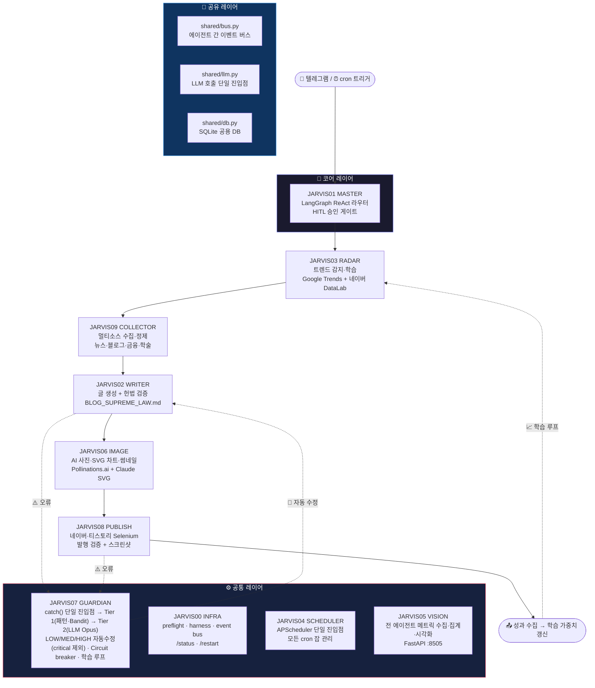
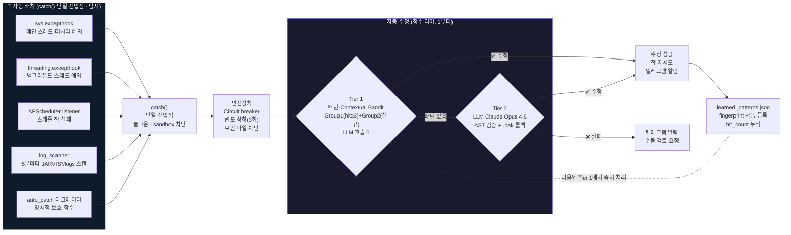

<div align="center">

# 🤖 JARVIS Agent

**트렌드 감지 → 수집 → 글 생성 → 이미지 → 발행 → 자가학습까지 스스로 도는 10-모듈 멀티에이전트 시스템**

[](https://python.org)
[](https://anthropic.com)
[](https://langchain-ai.github.io/langgraph/)
[](https://selenium.dev)
[](https://apscheduler.readthedocs.io)
[](https://en.wikipedia.org/wiki/Multi-armed_bandit)
[](https://streamlit.io)
[](https://sqlite.org)
[](#-팀--역할)
[](https://apple.com/macos)

> 텔레그램으로 명령하면 알아서 글을 쓰고, 이미지를 만들고, 발행하고, 오류가 나면 스스로 고칩니다.

<br>


<sub>▲ <b>JARVIS Hub 통합 대시보드</b> (<code>localhost:9199</code>) — 10개 에이전트(JARVIS00~09)의 실시간 상태·상호 연결·메트릭을 한 화면에. 데몬 기동 시 자동 실행.</sub>

</div>

---

## 📊 프로젝트 수치

<div align="center">

| 🗂️ 에이전트 모듈 | 📝 Python 코드 | 📄 파일 수 | 🔧 등록 도구 | 🛡️ 정책 검증 항목 | 🧠 누적 오류 자동처리 |
|:-:|:-:|:-:|:-:|:-:|:-:|
| **10개** | **68,900 LOC** | **168개** | **29개** | **40종** | **1,378건 · 해결률 82%** |

</div>

---

## 🖥️ 웹 대시보드 — 실시간 시연

**▶ 로컬 실행 주소: [`http://localhost:9199`](http://localhost:9199)**

`python jarvis_daemon.py` 한 줄이면 데몬과 함께 Streamlit 통합 현황판(`hub.py` — 대시보드 단일 진입점)이 자동으로 떠오릅니다. 발행·트렌드·품질·성과·AI 학습·오류·스케줄·시스템을 **9개 탭** 한 화면에서 실시간 모니터링합니다.

<table>
  <tr>
    <td width="50%" align="center" valign="top">
      <br>
      <sub><b>🛡️ 오류 자동 캐치·수정</b><br>catch() 단일 진입점 → 2-Tier 자동 복구 · 누적 1,378건 · 자동+수동 해결률 82%</sub>
    </td>
    <td width="50%" align="center" valign="top">
      <br>
      <sub><b>📡 트렌드 레이더</b><br>Google·Naver 50개 키워드 실시간 수집 + 발행 기회점수 TOP 15</sub>
    </td>
  </tr>
  <tr>
    <td align="center" valign="top">
      <br>
      <sub><b>📝 발행 관리</b><br>네이버·티스토리 발행 이력·파이프라인·품질 분석 (이번 달 66건)</sub>
    </td>
    <td align="center" valign="top">
      <br>
      <sub><b>🗓️ 스케줄러</b><br>cron/interval 35개 잡 단일 진입점 · 오늘 50건 실행 · 성공률 100%</sub>
    </td>
  </tr>
  <tr>
    <td align="center" valign="top" colspan="2">
      <br>
      <sub><b>⚙️ 시스템</b> — 데몬 가동 상태 · DB 용량 · 10개 에이전트별 잡 실행 이력</sub>
    </td>
  </tr>
</table>

---

## ✨ 핵심 기능

| 기능 | 설명 |
|------|------|
| 📝 **블로그 자동 발행** | 경제 브리핑(매일 06:30) + 테마주 분석(매일 16:00) — 네이버·티스토리 동시 발행 |
| 🖼️ **AI 이미지 자동 생성** | 글 키워드 기반 Pollinations.ai → 매 글마다 새로운 이미지 창작 (dedupe 포함) |
| 📡 **트렌드 레이더** | Google Trends + 네이버 DataLab 실시간 수집 → 핫 키워드 자동 탐지 |
| 🛡️ **자동 캐치·수정 시스템** | `catch()` 단일 진입점 → Tier 1(패턴·Contextual Bandit) → Tier 2(LLM Opus 4.6) — LOW/MED/HIGH 자동 복구 (CRITICAL은 패턴만 + 수동 검토) |
| 🔒 **보안 전문가급 안전장치** | Circuit breaker · 빈도 기반 severity 자동 상향(3회) · 보안 파일 수정 절대 금지 |
| 🏛️ **헌법형 거버넌스** | `precommit_check.py` 947줄 — 40종 정책을 pre-commit 훅·주간 감사로 강제 (+ 데몬 부팅은 `preflight.py` 검증) |
| 📊 **통합 대시보드** | hub.py 단일 진입점(port 9199) — 발행 이력·오류 현황·학습 곡선 한눈에 |
| 💬 **텔레그램 인터페이스** | 자유 문장 → ReAct 라우터 → 에이전트 디스패치 + 인라인 버튼 HITL 승인 |

---

## 🏗️ 시스템 아키텍처



---

## 📦 에이전트 모듈

| 에이전트 | 폴더 | 역할 | 개발자 |
|---------|------|------|--------|
| **JARVIS00** INFRA | `JARVIS00_INFRA/` | 데몬 라이프사이클·시스템 상태·검증 하니스 | HJ |
| **JARVIS01** MASTER | `JARVIS01_MASTER/` | 자유 문장 → 인텐트 분류 → ReAct 디스패치 (LangGraph) | HJ |
| **JARVIS02** WRITER | `JARVIS02_WRITER/` | 경제 브리핑·테마주 블로그 자동 작성 (헌법 준수) | NY |
| **JARVIS03** RADAR | `JARVIS03_RADAR/` | Google Trends + 네이버 DataLab 트렌드 수집·분석 | NY |
| **JARVIS04** SCHEDULER | `JARVIS04_SCHEDULER/` | APScheduler 단일 진입점 — 모든 잡 등록·조회·제어 | HJ |
| **JARVIS05** VISION | `JARVIS05_VISION/` | 전 에이전트 메트릭 수집·집계·시각화 API (FastAPI :8505) | HJ |
| **JARVIS06** IMAGE | `JARVIS06_IMAGE/` | AI 사진(Pollinations)·Claude SVG 차트·썸네일·dedupe | NY |
| **JARVIS07** GUARDIAN | `JARVIS07_GUARDIAN/` | 오류 수집·2-Tier 자동 수정(패턴·Bandit→LLM)·자가 진단 | HJ |
| **JARVIS08** PUBLISH | `JARVIS08_PUBLISH/` | 네이버·티스토리 Selenium 발행자·카테고리·쿠키 관리 | NY |
| **JARVIS09** COLLECTOR | `JARVIS09_COLLECTOR/` | 주제별 뉴스·블로그·금융 데이터 수집·정제 | NY |

> **HJ** = 김효중 (주도 개발) &nbsp;|&nbsp; **NY** = 김나연 (공동 개발)

---

## 📅 자동 발행 파이프라인

```mermaid
gantt
    title 일일 자동 발행 파이프라인
    dateFormat HH:mm
    axisFormat %H:%M

    section 새벽 유지보수
        git 커밋 회고 & 학습 자산화     :done, 03:30, 15m
        헌법 감사 (드리프트 검출)        :done, 04:30, 30m

    section 오전 발행 세트 (06:30)
        자가 진단 & 코드 수정           :active, 06:15, 15m
        경제 지표 수집 (JARVIS09)       :active, 06:30, 10m
        경제 브리핑 글 생성 (WRITER)    :active, 06:40, 15m
        AI 이미지 생성 (IMAGE)          :active, 06:55, 10m
        네이버·티스토리 발행 (PUBLISH)  :active, 07:05, 10m

    section 오후 발행 세트 (16:00)
        자가 진단 & 코드 수정           :16:00, 15m
        테마 트렌드 수집 (RADAR+J09)    :16:15, 10m
        테마주 분석 글 생성 (WRITER)    :16:25, 15m
        AI 이미지 생성 (IMAGE)          :16:40, 10m
        네이버·티스토리 발행 (PUBLISH)  :16:50, 10m
```



<sub>※ 실제 cron 잡은 **06:30 / 16:00 두 개의 세트 트리거**뿐입니다. 각 세트는 단일 콜백 안에서 자가진단→수집→글→이미지→발행을 *순차* 실행하며, 위 간트의 하위 단계 시각은 흐름 이해용 예시입니다(자가진단 소요에 따라 실제 발행 시각은 가변).</sub>

| 시각 | 잡 이름 | 내용 |
|------|---------|------|
| **06:30** | 경제 브리핑 세트 | 자가 진단 → 경제 지표 수집 → 글 작성 → 이미지 → 발행 |
| **16:00** | 테마주 분석 세트 | 자가 진단 → 트렌드 테마 선정 → 글 작성 → 이미지 → 발행 |
| **03:30** | git 회고 | 전날 코드 변경 D-1 학습 자산화 |
| **매주 일 04:30** | 헌법 감사 | 정책 위반·드리프트 검출 + 개선 제안 (주 1회) |
| **격주 월 04:00** | 파일 정리 | 오래된 로그·스크린샷·트렌드 캐시 자동 삭제 |

---

## 🧠 자가 학습 시스템

오류가 발생할수록 점점 똑똑해지는 폐쇄 학습 루프:



**심각도별 처리 매트릭스:**

| 심각도 | Tier 1 (패턴·Bandit) | Tier 2 (LLM) | 텔레그램 알림 |
|--------|:---:|:---:|:---:|
| ⚪ LOW | ✅ | ✅ → 학습 저장 | ✅ |
| 🟡 MEDIUM | ✅ | ✅ | ✅ |
| 🟠 HIGH | ✅ | ✅ | ✅ |
| 🔴 CRITICAL | ✅ | ❌ (LLM 생략 — 안전) | ✅ 항상 |

| 지표 | 현재 값 | 의미 |
|------|---------|------|
| 누적 패턴 | **44개** | fingerprint 즉시 매칭 가능 오류 유형 (노이즈 정리 후 유효 패턴) |
| 총 적중 수 | **249회** | LLM 호출 없이 자동 처리된 횟수 (런타임 누적·증가 중) |
| 누적 오류 처리 | **1,378건 / 82%** | `error_log` 누적 수집 · 자동+수동 해결률 |
| 오류 기록 | **289건 / 5,981줄** | `JARVIS07_GUARDIAN/ERRORS.md` 구조화 회고 |
| 체크포인트 | **50MB** | `react_checkpoints.sqlite` (ReAct 실가동 증거) |

---

## 🔒 거버넌스 & 안전 설계

```
외부 영향 도구 (발행·파일 수정·잡 변경)
              │
              ▼
  텔레그램 인라인 버튼 ✅/❌
     (HITL Human-in-the-Loop)
              │
        승인 후에만 실행
              │
              ▼
  _safe_path 3중 방어  ───  bash 화이트리스트
  (경로탈출/심볼릭/deny dir)   (15개 deny 패턴)
              │
              ▼
     .bak 자동 백업 + AST 검증
         실패 시 자동 롤백
```

| 보호 레이어 | 구현 | 역할 |
|------------|------|------|
| HITL 승인 게이트 | `approved_context` / `PermissionError` | 외부 영향 도구 100% 차단 |
| 정책 정적 강제 | `precommit_check.py` 947줄 | 40종 위반 자동 감지 |
| 파일 안전 박스 | `_safe_path()` | 경로 탈출·심볼릭·deny dir 차단 |
| 셸 안전 박스 | `_BASH_WHITELIST` | 화이트리스트 외 명령 차단 |
| 변경 안전망 | `.bak` 백업 + AST 검증 | 코드 수정 실패 시 자동 롤백 |

---

## 💬 텔레그램 인터페이스

| 명령어 | 설명 | 권한 |
|--------|------|------|
| `/status` | 전체 에이전트 상태 요약 | 조회 |
| `/jobs` · `/jobs_next` | 스케줄 잡 목록 + 다음 실행 시각 | 조회 |
| `/errors` · `/errors_stats` | 최근 오류 목록 / 통계 | 조회 |
| `/help` · `/agents` | 명령 도움말 / 등록 에이전트 | 조회 |
| `/restart` · `/quit` | 데몬 재시작 / 종료 (슬래시는 즉시 실행) | 관리 |
| `"경제 브리핑 써줘"` | ReAct → WRITER 발행 (blog.economic_post.create) | ✅ 승인 필요 |
| `"테마주 글 써줘"` | ReAct → WRITER 발행 (blog.theme_post.create) | ✅ 승인 필요 |
| `"데몬 재시작해줘"` | 자유 문장 → infra.daemon.restart | ✅ 승인 필요 |
| `"AI 트렌드 분석해줘"` | ReAct → RADAR (trend.report) | 조회 (SAFE) |
| `"최근 오류 보여줘"` | ReAct → GUARDIAN (error.list) | 조회 (SAFE) |

> **외부 영향** 동작(발행·잡 변경·자유 문장 데몬 제어)만 텔레그램 인라인 버튼 ✅/❌ 통과 후 실행됩니다. 슬래시 `/restart`·`/quit`은 관리 명령으로 즉시 실행, 조회/SAFE 인텐트는 승인 없이 응답합니다. (오류 자동 수정은 내부 자동 승인 — 인라인 버튼 없음)

---

## 🚀 빠른 시작

### 사전 요구사항

- Python 3.10+ (개발·운영 환경 3.10.19)
- Chrome + ChromeDriver (Selenium 발행용)
- 텔레그램 봇 토큰 ([BotFather](https://t.me/BotFather))
- 네이버 블로그 계정 / 티스토리 블로그 계정
- Anthropic Claude Max 구독 (OAuth 자동 인증 — API 키 불필요)

### 설치

```bash
git clone https://github.com/youandi3535/jarvis-agent.git
cd jarvis-agent

# 가상환경 생성
python -m venv .venv
source .venv/bin/activate          # Windows: .venv\Scripts\activate

# 의존성 설치
pip install -r JARVIS02_WRITER/requirements.txt
pip install claude-code-sdk python-dotenv apscheduler streamlit scikit-learn numpy chromadb

# Claude 인증 (OAuth)
claude auth login

# 환경변수 설정
cp .env.example .env
# .env 파일을 열어서 API 키·계정 정보 입력
```

### 환경변수 (.env)

| 항목 | 설명 | 발급처 |
|------|------|--------|
| *(Claude 인증)* | Claude Code SDK OAuth — `claude auth login` 으로 자동 처리 | `claude auth login` |
| `TELEGRAM_TOKEN` | 텔레그램 봇 토큰 | [@BotFather](https://t.me/BotFather) |
| `TELEGRAM_CHAT_ID` | 텔레그램 채팅 ID | getUpdates API |
| `NV_USERNAME` / `NV_PASSWORD` | 네이버 계정 | [naver.com](https://naver.com) |
| `TS_USERNAME` / `TS_PASSWORD` | 티스토리 계정 | [tistory.com](https://tistory.com) |
| `NAVER_CLIENT_ID` / `SECRET` | 네이버 DataLab API | [developers.naver.com](https://developers.naver.com) |
| `BOK_ECOS_KEY` | 한국은행 ECOS API | [ecos.bok.or.kr](https://ecos.bok.or.kr) |
| `DART_API_KEY` / `KOSIS_API_KEY` | (선택) 전자공시·통계청 수집 | DART / KOSIS |

> 이미지 생성은 **Pollinations.ai(키 불필요) + Claude SVG**를 사용하므로 별도 이미지 API 키가 필요 없습니다.

### 실행

```bash
# 데몬 시작 (포그라운드)
python jarvis_daemon.py

# 백그라운드 실행
nohup python jarvis_daemon.py > logs/daemon.log 2>&1 &

# 종료
pkill -f jarvis_daemon.py
```

### 통합 대시보드

```bash
streamlit run hub.py --server.port 9199
# http://localhost:9199 접속
```

---

## 🔧 기술 스택

| 분류 | 사용 기술 | 역할 |
|------|----------|------|
| **LLM** | Anthropic Claude Sonnet 4.6 / Opus 4.6 | 글 생성·오류 분석·자가 수정 |
| **에이전트 프레임워크** | LangGraph ReAct + SqliteSaver | 멀티스텝 추론·체크포인트 |
| **스케줄러** | APScheduler 3.x | cron·interval 단일 진입점 |
| **브라우저 자동화** | Selenium 4 + Chrome | 네이버·티스토리 발행 |
| **데이터베이스** | SQLite (WAL 모드) | 공용 DB·체크포인트 |
| **벡터 검색** | ChromaDB | 오류·Q&A 시맨틱 검색 (GUARDIAN `qa_resolver`) |
| **강화학습** | Contextual Bandit (Linear UCB · numpy) | Tier 1 fixer 선택을 보상으로 학습 |
| **트렌드 수집** | pytrends (Google) + 네이버 DataLab API | 실시간 키워드 분석 |
| **금융 데이터** | pykrx · yfinance | 주가·지표 수집 |
| **이미지 생성** | Pollinations.ai (AI 사진) + Claude SVG·matplotlib (차트) | 글별 맞춤 이미지 |
| **대시보드** | Streamlit | 통합 현황 모니터링 |
| **알림** | Telegram Bot API | 실시간 승인·보고 |

---

## 👥 팀 & 역할

**2인 팀 · 전 과정 페어 프로그래밍으로 공동 개발.**  
두 개발자가 **개발자(김효중) macOS 한 대에서 함께 작업**했습니다.  
git 커밋은 단일 계정(`youandi3535`)으로 기록되지만, 설계·구현 전 과정을 두 사람이 함께 진행했습니다.

```
┌─────────────────────────────────┐  ┌──────────────────────────────────┐
│      김효중 (HJ) · 주도 개발     │  │      김나연 (NY) · 공동 개발      │
│   에이전트 플랫폼 · 신뢰성 코어   │  │   콘텐츠 · 수집 · 발행 파이프라인  │
│                                 │  │                                  │
│  · JARVIS01 (LangGraph ReAct)   │  │  · JARVIS02 (블로그 글 생성)      │
│  · JARVIS00·05 (데몬·검증·모니터)│  │  · JARVIS03 (트렌드 분석)        │
│  · JARVIS07 (2-Tier 자동 수정)  │  │  · JARVIS06 (AI 이미지 생성)     │
│  · JARVIS04 (APScheduler)       │  │  · JARVIS08 (네이버·티스토리)    │
│  · shared/ · 거버넌스            │  │  · JARVIS09 (데이터 수집·정제)   │
└─────────────────────────────────┘  └──────────────────────────────────┘
              ↑                                     ↑
              └──────────────┬──────────────────────┘
                     공동 개발 (같은 macOS)
                   git commit: youandi3535
```

| 멤버 | 역할 | 주력 에이전트 |
|------|------|-------------|
| **김효중** (HJ) | 주도 개발 · 에이전트 플랫폼 · 신뢰성 코어 | JARVIS00·01·04·05·07 · shared/ |
| **김나연** (NY) | 공동 개발 · 콘텐츠 · 수집 · 발행 파이프라인 | JARVIS02·03·06·08·09 |

> 운영 데몬은 발행 사고·학습 자산 오염 방지를 위해 개발자 macOS 1곳에서만 상시 실행합니다.

---

## 🔌 새 에이전트 추가

`jarvis_daemon.py` 수정 없이 폴더 추가만으로 자동 등록됩니다:

```
JARVIS10_NAME/
  └─ name_agent.py   ← register(scheduler, bus) + declare(...) 정의
```

| 필수 항목 | 위치 | 역할 |
|-----------|------|------|
| `{name}_agent.py` | 폴더 안 | 에이전트 진입점 |
| `register(scheduler, bus)` | agent.py 내 | 데몬 자동 등록 |
| `declare(agent_id=..., ...)` | agent.py 모듈 레벨 | 텔레그램·허브 자동 노출 |
| `AGENTS.md` 등록 행 | 루트 | 등록 검증 |

```bash
# 등록 검증
python shared/agent_registration_check.py
```

자세한 규약은 [AGENTS.md](AGENTS.md) 참조.

---

## 📐 프로젝트 원칙

| 원칙 | 내용 |
|------|------|
| **단일 진입점** | 도메인별 책임 폴더 고정 (이미지→J06·발행→J08·스케줄→J04·LLM→shared/llm.py) |
| **HITL 승인** | 외부 영향 도구는 텔레그램 인라인 버튼 ✅ 후에만 실행 |
| **오류 기록 의무** | 모든 오류·수정 이력 `JARVIS07_GUARDIAN/ERRORS.md` 단일 저장소 |
| **정적 강제** | `precommit_check.py` 40종 — pre-commit 훅 + 주간 감사(Auditor) / 데몬 부팅 검증은 `preflight.py`(Layer 0) 별도 |
| **학습 루프** | 오류 수정 사례 자동 자산화 → 다음 오류는 LLM 0 즉시 처리 |

자세한 규정은 [CLAUDE.md](CLAUDE.md) 참조.

---

## 📄 라이선스

Private repository — 무단 배포 금지.
