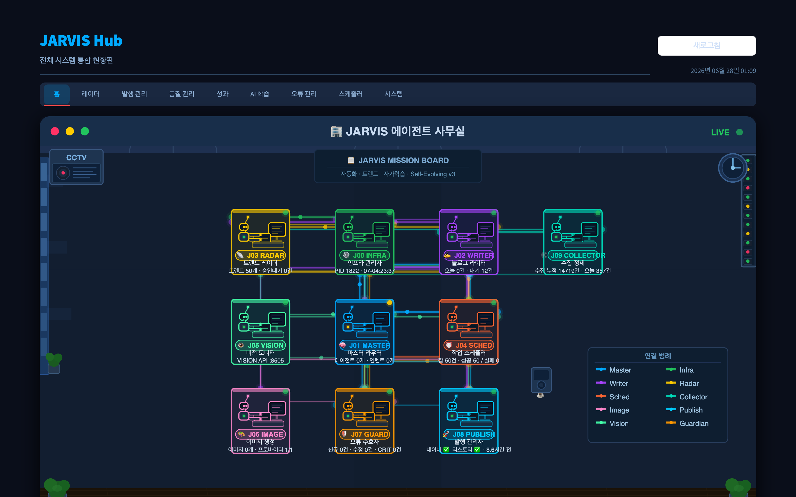
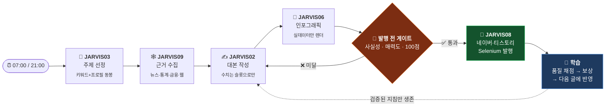
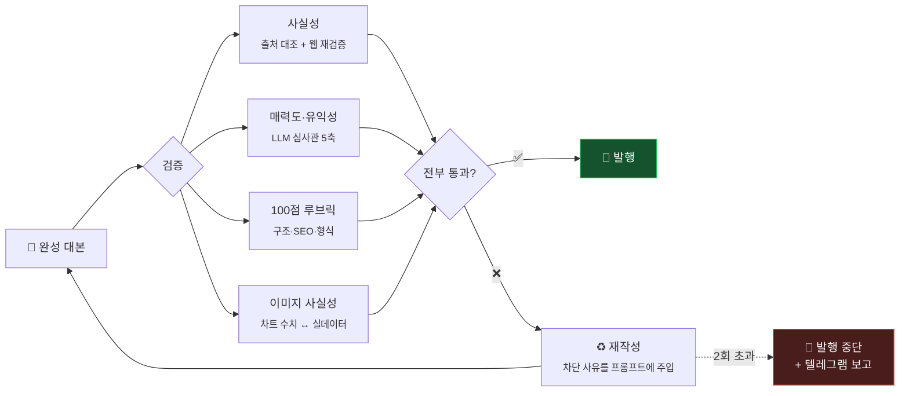
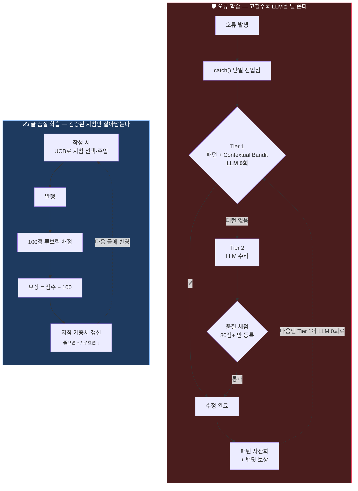
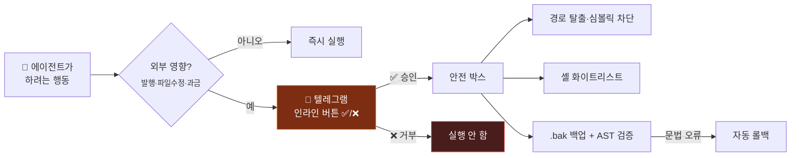
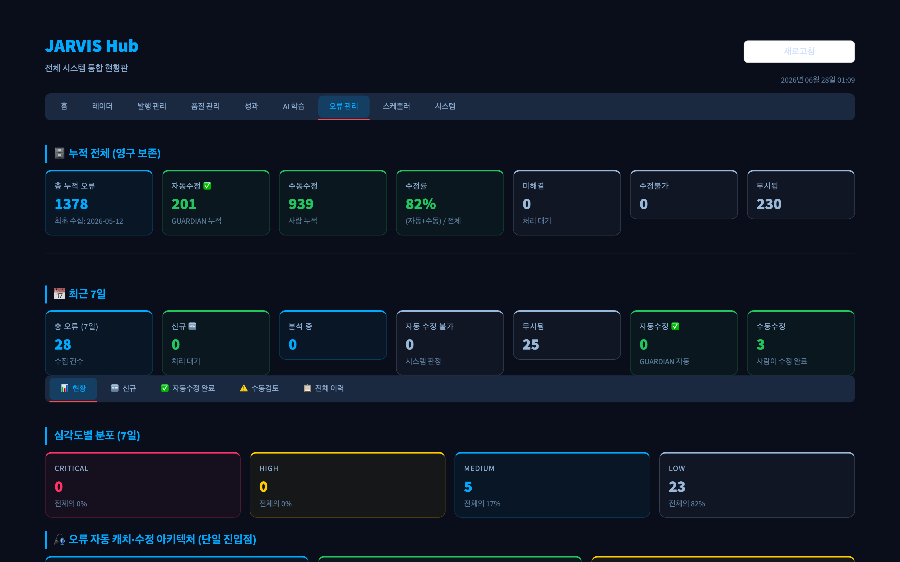
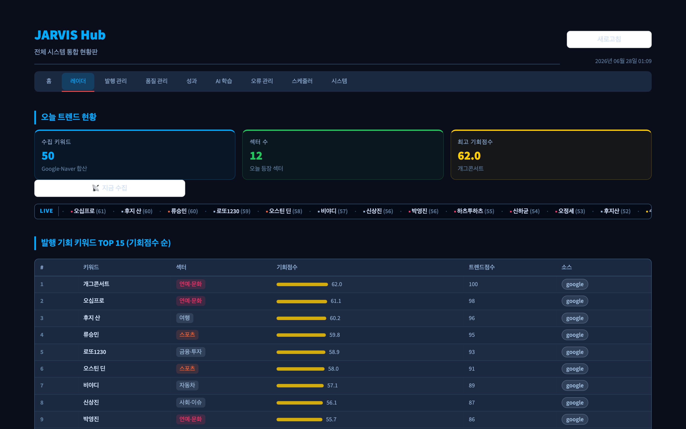
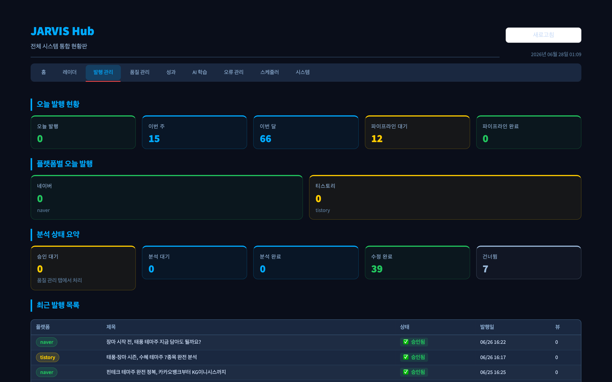
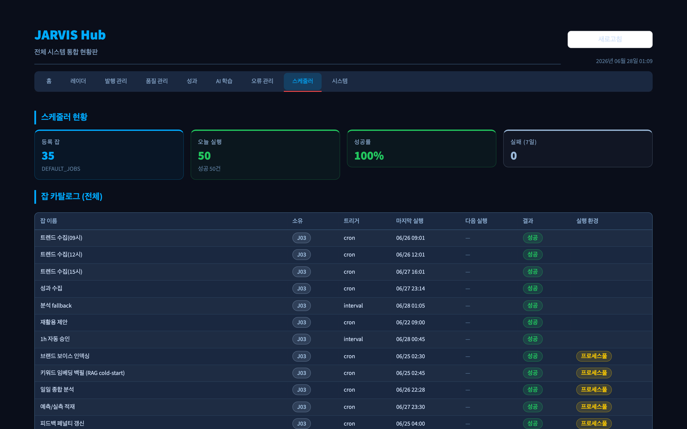
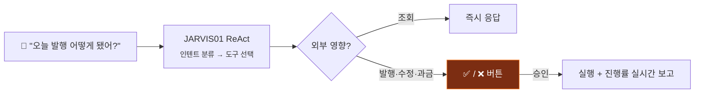

<div align="center">

# 🤖 JARVIS Agent

### 트렌드 감지 → 수집 → 글 작성 → 이미지 → 발행 → 자가학습까지<br/>**사람 없이 하루 두 번 스스로 도는 10-모듈 멀티에이전트 시스템**

[](https://python.org)
[](https://anthropic.com)
[](https://langchain-ai.github.io/langgraph/)
[](https://selenium.dev)
[](https://apscheduler.readthedocs.io)
[](https://nextjs.org)
[](https://fastapi.tiangolo.com)
[](https://sqlite.org)
[](#-팀--역할)

**매일 07:00 경제 브리핑 · 21:00 테마주 분석**을 네이버·티스토리에 자동 발행합니다.<br/>
글이 기준 미달이면 **발행 자체가 되지 않고**, 오류가 나면 **스스로 고치고 학습**합니다.



<sub>▲ <b>JARVIS Hub</b> (<code>localhost:9199</code>) — 10개 에이전트의 실시간 상태·연결·메트릭. 데몬 기동 시 자동 실행</sub>

</div>

---

## 📊 한눈에

<div align="center">

| 🗂️ 에이전트 | 📝 Python | 📄 파일 | ⏰ 스케줄 잡 | 🔧 등록 도구 | 🛡️ 정책 검증 | 📰 누적 발행 |
|:-:|:-:|:-:|:-:|:-:|:-:|:-:|
| **10개** | **81,900+ LOC**<br/><sub>+ 대시보드 4,947</sub> | **201개** | **42개** | **20개** | **58종**<br/><sub>18 카테고리</sub> | **230건**<br/><sub>경제 89 · 테마 141</sub> |

</div>

> 모든 수치는 코드·DB에서 **실측**했습니다 (2026-07-25 기준). 산출 방법은 [운영 증거](#-운영-증거) 참조.

---

## 🎯 30초 요약 — 이 시스템이 하는 일


```mermaid
flowchart LR
    T(["⏰ 07:00 / 21:00"]) --> R

    R["📡 <b>JARVIS03</b><br/>주제 선정<br/><sub>키워드+프로필 동봉</sub>"]
    --> C["🕸️ <b>JARVIS09</b><br/>근거 수집<br/><sub>뉴스·통계·금융·웹</sub>"]
    --> W["✍️ <b>JARVIS02</b><br/>대본 작성<br/><sub>수치는 슬롯으로만</sub>"]
    --> I["🎨 <b>JARVIS06</b><br/>인포그래픽<br/><sub>실데이터만 렌더</sub>"]
    --> G{"🔎 <b>발행 전 게이트</b><br/>사실성 · 매력도 · 100점"}

    G -- "❌ 미달" --> W
    G -- "✅ 통과" --> P["🚀 <b>JARVIS08</b><br/>네이버·티스토리<br/>Selenium 발행"]
    P --> L["🧠 <b>학습</b><br/>품질 채점 → 보상<br/>→ 다음 글에 반영"]
    L -. "검증된 지침만 생존" .-> W

    style G fill:#7c2d12,stroke:#f97316,color:#fff
    style P fill:#14532d,stroke:#22c55e,color:#fff
    style L fill:#1e3a5f,stroke:#60a5fa,color:#fff
```

**핵심 설계 3가지**

| # | 원칙 | 무엇을 막는가 |
|:-:|------|--------------|
| **1** | **결함은 절대 송출되지 않는다** | 게이트를 통과 못 하면 재작성. *"발행 후 실패"라는 상태가 존재하지 않음* |
| **2** | **LLM은 수치를 쓰지 못한다** | 차트·본문 수치는 수집 실데이터를 **슬롯으로 주입** → 환각 수치 구조적 차단 |
| **3** | **고칠 때 한 곳만 고친다** | 같은 로직이 두 곳에 있으면 커밋이 차단됨 (정책 검증 58종) |

---

## 🏗️ 시스템 아키텍처


```mermaid
flowchart TB
    subgraph EXT[" "]
        direction LR
        TG["💬 텔레그램<br/><sub>자유 문장 · 승인 버튼</sub>"]
        CRON["⏰ cron<br/><sub>07:00 · 21:00</sub>"]
    end

    subgraph CORE["🧠 코어"]
        M["<b>JARVIS01</b> MASTER<br/>LangGraph ReAct 라우터<br/><sub>인텐트 분류 → 디스패치</sub>"]
        S["<b>JARVIS04</b> SCHEDULER<br/>모든 cron·interval 단일 진입점<br/><sub>42개 잡</sub>"]
    end

    subgraph PIPE["📰 콘텐츠 파이프라인 (subprocess 격리)"]
        direction LR
        R3["<b>03</b> RADAR<br/>주제"] --> C9["<b>09</b> COLLECTOR<br/>수집"] --> W2["<b>02</b> WRITER<br/>대본+게이트"] --> I6["<b>06</b> IMAGE<br/>이미지"] --> P8["<b>08</b> PUBLISH<br/>발행"]
    end

    subgraph OPS["🛡️ 운영·신뢰성"]
        G7["<b>JARVIS07</b> GUARDIAN<br/>오류 캐치 → 2-Tier 자동수정<br/><sub>+ 강화학습</sub>"]
        I0["<b>JARVIS00</b> INFRA<br/>preflight · harness · watchdog"]
        V5["<b>JARVIS05</b> VISION<br/>메트릭 집계 API"]
    end

    subgraph SH["🔗 shared/ — 신경계 (단일 진입점)"]
        direction LR
        SL["llm.py<br/><sub>모든 LLM 호출</sub>"]
        SD["db.py<br/><sub>SQLite 공용</sub>"]
        SB["bus.py<br/><sub>이벤트</sub>"]
        ST["tools.py<br/><sub>도구 카탈로그</sub>"]
    end

    TG --> M
    CRON --> S
    M --> PIPE
    S --> PIPE
    PIPE -. "⚠️ 오류" .-> G7
    G7 -. "🔧 수정 (발행 후)" .-> PIPE
    I0 -.-> PIPE
    PIPE --> SH
    OPS --> SH

    style CORE fill:#1a1a2e,stroke:#7c83fd,color:#fff
    style PIPE fill:#14532d,stroke:#22c55e,color:#fff
    style OPS fill:#4a1d1d,stroke:#e94560,color:#fff
    style SH fill:#0f3460,stroke:#4dabf7,color:#fff
```

---

## 📅 하루 흐름


```mermaid
gantt
    title 24시간 자동 운영 타임라인
    dateFormat HH:mm
    axisFormat %H시

    section 🌙 새벽 정비
        QA 지식 학습              :02:00, 30m
        심층 코드 감사 (LLM)       :crit, 03:00, 40m
        git 회고 · 학습 자산화      :03:30, 20m
        인포그래픽 디자인 학습      :05:00, 30m

    section ☀️ 경제 브리핑
        트렌드 수집 · 주제팩        :06:00, 20m
        쿠키 사전점검              :06:30, 10m
        발행 (수집→글→이미지→게이트) :crit, 07:00, 45m
        결과 점검                  :07:45, 10m

    section 🌆 테마주
        테마 선계산 (수집 캐시)     :20:00, 30m
        쿠키 사전점검              :20:30, 10m
        발행 (수집→글→이미지→게이트) :crit, 21:00, 45m
        결과 점검                  :21:45, 10m

    section 🧠 야간 학습
        일일 학습 리포트           :22:00, 20m
        글 품질 보상 귀속          :23:45, 10m
```

**발행은 하루 딱 두 번 — 07:00과 21:00뿐입니다.**

| 시각 | 잡 | 하는 일 |
|:----:|-----|--------|
| **07:00** | `j01_economic_post` | 발행 전 자체수리(LLM-0) → 경제 브리핑 발행 |
| **21:00** | `j01_theme_post_21` | 발행 전 자체수리(LLM-0) → 테마주 분석 발행 |
| 06:00 / 20:00 | 선행 수집 | **선행이 안 끝나면 발행하지 않는다** (`requires` 강제) |
| 06:30 / 20:30 | 쿠키 사전점검 | 발행 30분 전 — **발행 시각에서 자동 파생** |
| 03:00 | 심층 코드 감사 | 비싼 LLM 수리는 발행과 분리 → 발행 지연 0 |
| 23:45 | 품질 보상 귀속 | 오늘 쓴 글의 점수로 작성 지침 가중치 갱신 |

> **왜 발행 중엔 다른 일을 안 하나** — 발행 파이프라인이 도는 동안 배경 LLM 작업(자가수정·학습·감사)은 **자동 보류**됩니다. 한도를 글 작성에 몰아주기 위해서입니다. 발행이 끝나면 10분 내 자동 재개됩니다.

---

## 🔎 발행 전 품질 게이트 — 결함은 나가지 않는다

완성된 글은 **발행 전** 검증 순환을 통과해야만 송출됩니다. 실패하면 재작성하고, 끝내 통과 못 하면 **발행하지 않습니다**.


```mermaid
flowchart LR
    D["📝 완성 대본"] --> V{"검증"}
    V --> F["사실성<br/><sub>출처 대조 + 웹 재검증</sub>"]
    V --> E["매력도·유익성<br/><sub>LLM 심사관 5축</sub>"]
    V --> S["100점 루브릭<br/><sub>구조·SEO·형식</sub>"]
    V --> M["이미지 사실성<br/><sub>차트 수치 ↔ 실데이터</sub>"]

    F & E & S & M --> J{"전부 통과?"}
    J -- "✅" --> PUB["🚀 발행"]
    J -- "❌" --> RW["♻️ 재작성<br/><sub>차단 사유를 프롬프트에 주입</sub>"]
    RW --> D
    RW -. "2회 초과" .-> STOP["🛑 발행 중단<br/>+ 텔레그램 보고"]

    style PUB fill:#14532d,stroke:#22c55e,color:#fff
    style STOP fill:#4a1d1d,stroke:#ef4444,color:#fff
```

| 검수 차원 | 판정 방식 | 임계 | 실패 시 |
|----------|----------|:----:|--------|
| **사실성** | 수집 출처 대조 + 웹 재검증 | 근거 없으면 차단 | **차단** (fail-closed) |
| **매력도·유익성** | LLM 심사관 5축 채점 | 매력 70 · 유익 70 · 제목 60 · 독창 60 · 구성 65 | 재작성 |
| **종합 품질** | 100점 루브릭 (항목 38~40개) | **70점** | 재작성 |
| **이미지 사실성** | 차트 수치 ↔ 수집 실데이터 대조 | 출처 없으면 렌더 금지 | 실데이터로 대체 / 숫자 없는 카드 |

**100점 루브릭 구성** — 네 축이 합쳐 100점, 플랫폼·글종류별로 항목이 자동 전환됩니다.

| 축 | 배점 | 내용 |
|:--:|:----:|------|
| **A** | 20 | 매력도·유익성 (LLM 심사관 점수 합류) |
| **B** | 50 | 정확성·구조 (헌법 준수·분량·문단·헤더) |
| **C** | 20 | SEO (네이버/티스토리 각각 다른 항목) |
| **D** | 10 | 형식 (경제/테마 각각 다른 항목) |

- **재시도는 최대 2회** — 같은 실패가 반복되면 즉시 중단하고 사람에게 보고합니다 (무한 재작성 방지).
- **킬스위치**: `PREPUBLISH_FACT_GATE=0` · `PREPUBLISH_ENGAGEMENT_GATE=0` — 코드 수정 없이 즉시 비활성화.
- 단일 진입점 `JARVIS02_WRITER/prepublish_gate.py` — 경제·테마 두 경로가 **같은 게이트**를 공유.

---

## 🧠 두 개의 학습 루프

오류와 글 품질을 **각각 다른 강화학습**으로 개선합니다. 둘 다 UCB 기반이지만 대상이 다릅니다.


```mermaid
flowchart TB
    subgraph EL["🛡️ 오류 학습 — 고칠수록 LLM을 덜 쓴다"]
        direction TB
        E1["오류 발생"] --> E2["catch() 단일 진입점"]
        E2 --> E3{"Tier 1<br/>패턴 + Contextual Bandit<br/><b>LLM 0회</b>"}
        E3 -- "패턴 없음" --> E4["Tier 2<br/>LLM 수리"]
        E3 -- "✅" --> E5["수정 완료"]
        E4 --> E6{"품질 채점<br/>80점+ 만 등록"}
        E6 -- "통과" --> E5
        E5 --> E7["패턴 자산화<br/>+ 밴딧 보상"]
        E7 -. "다음엔 Tier 1이 LLM 0회로" .-> E3
    end

    subgraph QL["✍️ 글 품질 학습 — 검증된 지침만 살아남는다"]
        direction TB
        Q1["작성 시<br/>UCB로 지침 선택·주입"] --> Q2["발행"]
        Q2 --> Q3["100점 루브릭 채점"]
        Q3 --> Q4["보상 = 점수 ÷ 100"]
        Q4 --> Q5["지침 가중치 갱신<br/><sub>좋으면 ↑ / 무효면 ↓</sub>"]
        Q5 -. "다음 글에 반영" .-> Q1
    end

    style EL fill:#4a1d1d,stroke:#e94560,color:#fff
    style QL fill:#1e3a5f,stroke:#60a5fa,color:#fff
```

| | 오류 학습 | 글 품질 학습 |
|---|---|---|
| 엔진 | `bandit.py` (Contextual Linear UCB) | `quality_learner.py` (UCB + 보상 EMA) |
| arm / 대상 | fixer 전략 | 작성 지침(insight) |
| 보상 신호 | 수정 성공 여부 | **100점 루브릭 총점 ÷ 100** |
| 주기 | 오류 발생 시 (발행 중엔 보류) | 매일 23:45 |
| 목표 | LLM 호출을 줄인다 | 100점에 수렴한다 |

**심각도별 처리**

| 심각도 | Tier 1 (LLM 0) | Tier 2 (LLM) | 발행 중 |
|:------:|:---:|:---:|:---:|
| LOW / MEDIUM / HIGH | ✅ | ✅ | ⏸ **보류** (발행 후 처리) |
| CRITICAL | ✅ | ❌ 생략 (안전) | ▶ 즉시 (LLM 0회) |

---

## 🔒 안전 설계


```mermaid
flowchart LR
    A["🤖 에이전트가<br/>하려는 행동"] --> B{"외부 영향?<br/><sub>발행·파일수정·과금</sub>"}
    B -- "아니오" --> X["즉시 실행"]
    B -- "예" --> C["💬 텔레그램<br/>인라인 버튼 ✅/❌"]
    C -- "✅ 승인" --> D["안전 박스"]
    C -- "❌ 거부" --> Z["실행 안 함"]
    D --> D1["경로 탈출·심볼릭 차단"]
    D --> D2["셸 화이트리스트"]
    D --> D3[".bak 백업 + AST 검증"]
    D3 -- "문법 오류" --> R["자동 롤백"]

    style C fill:#7c2d12,stroke:#f97316,color:#fff
    style Z fill:#4a1d1d,stroke:#ef4444,color:#fff
```

| 레이어 | 구현 | 역할 |
|--------|------|------|
| **HITL 승인 게이트** | `approved_context` / `PermissionError` | 외부 영향 도구는 승인 없이 **실행 불가** |
| **정책 정적 강제** | `shared/precommit_check.py` | **58종** 위반을 커밋·부팅·감사 3곳에서 자동 차단 |
| **파일·셸 안전 박스** | `_safe_path()` · `_BASH_WHITELIST` | 경로 탈출·위험 명령 차단 |
| **변경 안전망** | `.bak` + AST 검증 | 자가수정 실패 시 자동 롤백 |
| **프로세스 격리** | subprocess + watchdog | 발행이 멈춰도 데몬은 산다 (freeze 시 강제 종료) |

---

## 📦 에이전트 모듈

| 에이전트 | 역할 | 단일 진입점 | 담당 |
|---------|------|-----------|:--:|
| **00** INFRA | 데몬 라이프사이클 · 검증 하네스 · 워치독 | `infra_agent.py` · `harness.py` | HJ |
| **01** MASTER | 자유 문장 → 인텐트 → ReAct 디스패치 | `router.py` · `agent_tools.py` | HJ |
| **02** WRITER | 대본 작성 · 헌법 집행 · **발행 전 게이트** | `prepublish_gate.py` · `law_enforcer.py` | NY |
| **03** RADAR | 트렌드 수집 · **주제 선정**(키워드+프로필) | `topic_pack.py` · `theme_picker.py` | NY |
| **04** SCHEDULER | 모든 cron·interval 단일 관리 (42잡) | `job_registry.py` | HJ |
| **05** VISION | 전 에이전트 메트릭 집계 API (`:8505`) | `vision_agent.py` | HJ |
| **06** IMAGE | **모든 이미지 생성** · 인포그래픽 · 사실성 검증 | `image_agent.py` · `draft_processor.py` | NY |
| **07** GUARDIAN | 오류 캐치 · 2-Tier 자동수정 · 강화학습 | `guardian_agent.py` · `quality_learner.py` | HJ |
| **08** PUBLISH | 네이버·티스토리 Selenium · 쿠키 | `platforms/` · `credentials/` | NY |
| **09** COLLECTOR | **모든 데이터 수집** — 파사드 한 줄 | `collect_all()` | NY |

> **HJ** 김효중 (주도) · **NY** 김나연 (공동) — 전 과정 페어 프로그래밍

---

## 🆕 최근 주요 업데이트

| 날짜 | 변경 | 왜 중요한가 |
|:----:|------|------------|
| 07-25 | **발행 시각 07:00·21:00 단일화** — 시간외 자동발행 경로 전면 삭제 | 예측 가능한 운영. 스위치 하나로 새는 잠재 경로 제거 |
| 07-25 | **실행모델 통일** — 경제·테마 모두 subprocess | 멈춰도 강제 종료 가능 · 고친 코드가 재시작 없이 즉시 반영 |
| 07-25 | **발행창 LLM 우선권** — 배경 작업 자동 보류 | 발행이 자기 오류 수리에 한도를 뺏기던 문제 해소 |
| 07-25 | **사실성 게이트 오차단 근본수정** | 결측(NaN)이 검증기를 크래시시켜 *진짜 사실*을 차단하던 버그 제거 |
| 07-24 | **글 품질 보상 = 100점 루브릭 총점** | 발행 전 채점과 학습 보상이 **같은 자**를 씀 → 100점 수렴 |
| 07-23 | **수집 단일 진입점 JARVIS09 통합** | 수집 오케스트레이션 5벌을 파사드 한 줄로. 소스 추가/제거가 1줄 |
| 07-11 | **차트 실데이터 슬롯 주입** | LLM이 수치를 쓸 수 있는 경로 자체를 제거 → 날조 구조적 차단 |
| 07-05 | **통합 콘텐츠 파이프라인** | 경제·테마가 하나의 경로 — 새 카테고리는 정책 dict 한 줄로 상속 |
| 07-03 | **글 품질 강화학습 폐쇄 루프** | 작성 지침이 검증을 거쳐 살아남거나 도태 |
| 06-28 | **발행 전 품질 게이트** | "발행 후 실패"라는 상태를 설계에서 제거 |

<details>
<summary>📜 이전 업데이트 더 보기</summary>

| 날짜 | 변경 |
|:----:|------|
| 07-17 | 전수 감사 — 죽은 코드 12건 삭제 · EventListener 이중 부착 등 근본수정 8종 |
| 07-17 | Max 스로틀 절단을 `infra_throttle`로 분기 — 결함 대본이 검증 순환에 갇히던 문제 해소 |
| 07 | 대시보드 Streamlit → **Next.js 16 + FastAPI** 전면 재작성 |
| 07-06 | 모델 단일 계층 통일 — 모델 ID는 `shared/llm.py` 단독 소유 ([ADR 017](docs/decisions/017-model-single-tier-sonnet5.md)) |
| 07-04 | 밴딧 arm = 유한 전략 — 상태 402MB → 45B ([ADR 016](docs/decisions/016-bandit-finite-strategy-arms.md)) |
| 07-02 | 설계-우선 리서치 파이프라인 ([ADR 012](docs/decisions/012-research-first-pipeline.md)) |
| 06-29 | 이미지 사실성 — 차트는 실데이터로만 ([ADR 010](docs/decisions/010-image-factuality-real-data.md)) |

</details>

---

## 🖥️ 웹 대시보드

**`http://localhost:9199`** (Next.js) · 데이터 API **`:9198`** (FastAPI, 39 엔드포인트)

`python jarvis_daemon.py` 한 줄이면 두 프로세스가 **자식으로 자동 기동**됩니다.

<table>
  <tr>
    <td width="50%" align="center" valign="top">
      <br/>
      <sub><b>🛡️ 오류 자동 캐치·수정</b><br/>catch() 단일 진입점 → 2-Tier 자동 복구</sub>
    </td>
    <td width="50%" align="center" valign="top">
      <br/>
      <sub><b>📡 트렌드 레이더</b><br/>Google·Naver 키워드 수집 + 기회점수</sub>
    </td>
  </tr>
  <tr>
    <td align="center" valign="top">
      <br/>
      <sub><b>📝 발행 관리</b><br/>발행 이력 · 파이프라인 · 품질 분석</sub>
    </td>
    <td align="center" valign="top">
      <br/>
      <sub><b>🗓️ 스케줄러</b><br/>42개 잡 단일 진입점 · 실행 이력</sub>
    </td>
  </tr>
</table>

---

## 💬 텔레그램 인터페이스

**자유 문장으로 명령하고, 위험한 행동은 버튼으로 승인합니다.**


```mermaid
flowchart LR
    U["🧑 &quot;오늘 발행 어떻게 됐어?&quot;"] --> R["JARVIS01 ReAct<br/><sub>인텐트 분류 → 도구 선택</sub>"]
    R --> S{"외부 영향?"}
    S -- "조회" --> A["즉시 응답"]
    S -- "발행·수정·과금" --> B["✅ / ❌ 버튼"]
    B -- "승인" --> E["실행 + 진행률 실시간 보고"]

    style B fill:#7c2d12,stroke:#f97316,color:#fff
```

| 유형 | 예시 | 권한 |
|------|------|:----:|
| 상태 조회 | `/status` · `/jobs` · "오늘 발행 어떻게 됐어?" | 즉시 |
| 발행 실행 | `/economic` · "테마글 지금 써줘" | ✅ 승인 필요 |
| 코드 변경 | "이 부분 고쳐줘" | ✅ 승인 필요 (계획 → 승인 → 실행) |
| 시스템 제어 | `/restart` · `/stop` · `/resume` | ✅ 승인 필요 |

발행·오류·품질 점수는 **실시간으로 텔레그램에 보고**됩니다 — 100점 항목별 점수, 차단 사유, 자동수정 결과까지.

---

## 🚀 빠른 시작

```bash
# 1) 설치
git clone <repo> && cd team_02p_202512_jarvis_agent
python3 -m venv .venv && source .venv/bin/activate
pip install -r requirements.txt

# 2) Claude 인증 (OAuth)
claude login

# 3) 환경변수
cp .env.example .env      # 네이버·티스토리 계정, 텔레그램 토큰, API 키 입력

# 4) 실행 — 데몬 하나면 전부 기동 (스케줄러·텔레그램봇·대시보드)
python jarvis_daemon.py

# 종료
pkill -f jarvis_daemon.py
```

**필수 환경변수**

| 키 | 용도 |
|----|------|
| `TELEGRAM_TOKEN` · `TELEGRAM_CHAT_ID` | 알림 · 승인 버튼 |
| `NV_ID` · `NV_PW` | 네이버 발행 |
| `TS_ID` · `TS_PW` | 티스토리 발행 |
| `NAVER_CLIENT_ID` · `NAVER_CLIENT_SECRET` | DataLab 트렌드 (선택) |
| `JARVIS_DB_PATH` | DB 경로 (기본 `~/.jarvis/jarvis.sqlite`) |

---

## 🔧 기술 스택

| 영역 | 사용 기술 |
|------|----------|
| **LLM** | Claude **Sonnet 5** 단일 모델 (`shared/llm.py` MODELS 단독 소유) · Claude Agent SDK |
| **오케스트레이션** | LangGraph (ReAct) · APScheduler · 자체 harness (5-Layer 검증 순환) |
| **수집** | yfinance · pykrx · DART · KOSIS · ECOS · 네이버 API · pytrends |
| **발행** | Selenium 4 (네이버 스마트에디터 · 티스토리) |
| **이미지** | 결정론 HTML/CSS 인포그래픽 + Playwright 렌더 · matplotlib · AI 사진 폴백 |
| **학습** | Contextual Linear UCB · UCB 랭킹 + 보상 EMA · MiniLM 임베딩(로컬) |
| **저장** | SQLite (WAL) 단일 DB · JSON 학습 자산 |
| **대시보드** | Next.js 16 · React 19 · Recharts · Tailwind · SWR / FastAPI |

---

## 📐 프로젝트 원칙

모든 수정에 예외 없이 적용되는 3원칙 — **위반하면 커밋이 차단**됩니다.

| # | 원칙 | 의미 | 위반 신호 |
|:-:|------|------|----------|
| **①** | **단일 진입점** | 한 가지 일은 한 곳에서만 | 고칠 때 2곳 이상 손대야 함 |
| **②** | **동적 설계** | 값·목록은 런타임 조회로 파생 | 코드에 박힌 숫자·목록·시각 |
| **③** | **전체 적용** | 네이버·티스토리 × 경제·테마 **4조합 전부** | 한쪽만 고쳐 다른 쪽에서 재발 |

> 결정의 *이유*는 [`docs/decisions/`](docs/decisions/README.md) ADR이 단일 진실 소스입니다.
> 사고 이력과 교훈은 [`JARVIS07_GUARDIAN/ERRORS.md`](JARVIS07_GUARDIAN/ERRORS.md)에 구조화 기록됩니다.

---

## 🔬 운영 증거

수치는 전부 코드·DB에서 조회한 값입니다 (2026-07-25).

| 지표 | 값 | 출처 |
|------|----|------|
| 누적 발행 글 | **230건** (경제 89 · 테마 141) | `post_analysis` |
| 누적 오류 처리 | **4,180+건** · 미해결 61건 (1.5%) | `error_log.status` |
| 자가진단 회차 | **103회** | `self_repair_runs` |
| 학습 패턴 | **48개** | `learned_patterns.json` |
| 활성 작성 지침 | **351개** · 보상 귀속 78건 | `learning_insights` · `insight_usage` |
| 잡 실행 이력 | **152,000+건** | `job_runs` |
| 정책 검증 | **58종** 위반 0건 | `precommit_check.run()` |

---

## ⚖️ 한계 (정직 기록)

| 항목 | 현재 상태 |
|------|----------|
| 🟡 **글 품질 보상 데이터** | 보상 기준을 100점 루브릭으로 바꾼 직후라 `quality_score` 누적이 아직 0건 — 다음 발행부터 쌓입니다 |
| 🟡 **테마 subprocess 전환** | 2026-07-25 전환. 구조 검증·왕복 테스트는 통과했으나 **실전 발행은 다음 21:00이 첫 회** |
| 🟡 **Max 구독 rate 천장** | 발행이 LLM을 몰아 씀 → 인터랙티브 세션과 같은 계정 공유 시 스로틀 가능. 발행창 배경작업 보류로 완화 |
| 🟡 **단일 머신 운영** | 발행 사고·학습 자산 오염 방지를 위해 개발자 macOS 1곳에서만 데몬 상시 실행 |
| 🟠 **Selenium 취약성** | 네이버·티스토리 UI 변경 시 발행자 수정 필요 (자동 감지 불가) |

---

## 👥 팀 & 역할

**2인 팀 · 전 과정 페어 프로그래밍으로 공동 개발.** 두 개발자가 **개발자(김효중) macOS 한 대에서 함께 작업**했습니다.
git 커밋은 단일 계정(`youandi3535`)으로 기록되지만, 설계·구현 전 과정을 두 사람이 함께 진행했습니다.

| 멤버 | 역할 | 주력 에이전트 |
|------|------|-------------|
| **김효중** (HJ) | 주도 개발 · 에이전트 플랫폼 · 신뢰성 코어 | JARVIS00 · 01 · 04 · 05 · 07 · `shared/` |
| **김나연** (NY) | 공동 개발 · 콘텐츠 · 수집 · 발행 파이프라인 | JARVIS02 · 03 · 06 · 08 · 09 |

**협업 워크플로우**

| 브랜치 | 용도 | 정책 |
|--------|------|------|
| `main` | 운영 — 데몬 실행 코드 | PR 머지만 (직접 push 금지) |
| `feat/hj` | 개발 통합 | PR → `main` |
| `feature/<task>` | 개별 기능 | PR → `feat/hj` |

> 운영(데몬·발행·학습 자산 갱신)은 HJ macOS 1곳에서만, 코드 작업은 두 사람이 함께.

---

## 🔌 새 에이전트 추가

`JARVIS{NN}_NAME/` 폴더에 4가지만 갖추면 데몬·텔레그램·대시보드에 **자동 노출**됩니다.

```bash
JARVIS10_NEW/
  └─ new_agent.py     # ① register(scheduler, bus)  ② declare(agent_id, status_fn, help_section)
# ③ AGENTS.md 등록 행  ④ 검증
python shared/agent_registration_check.py
```

`jarvis_daemon.py`는 **수정하지 않습니다** — 부팅 시 폴더를 훑어 자동 등록합니다.

---

<div align="center">

## 📄 라이선스

MIT License

<sub>Built with Claude Sonnet 5 · Anthropic Claude Agent SDK</sub>

</div>
