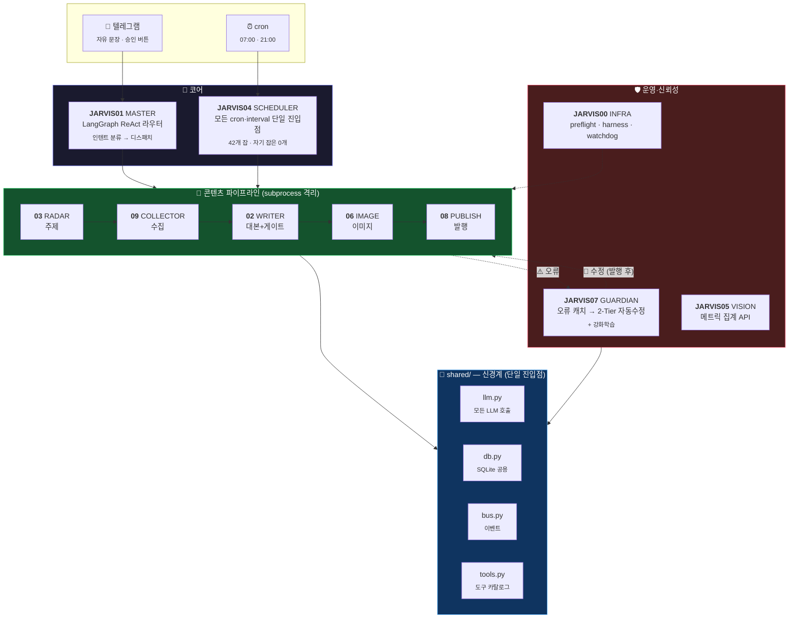
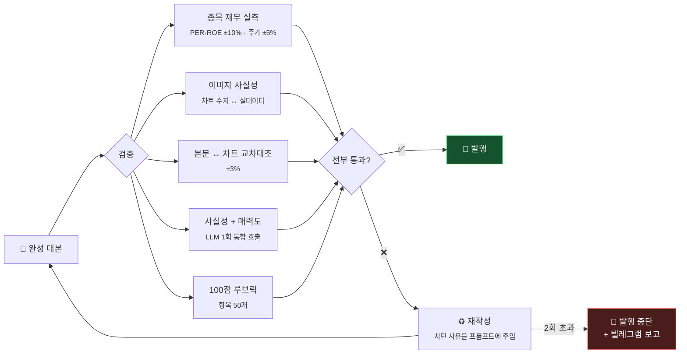
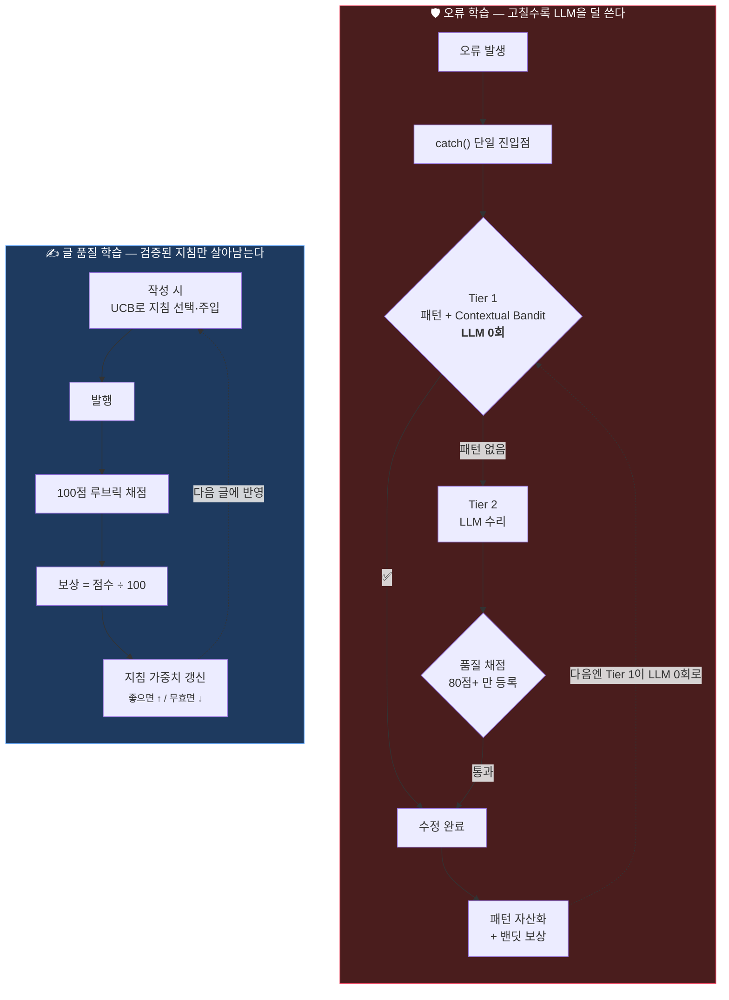
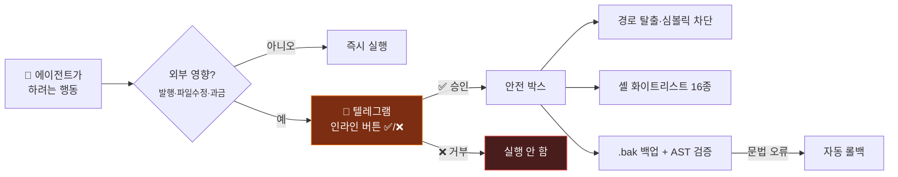
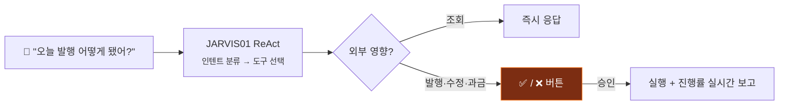

<div align="center">

# 🤖 JARVIS Agent

### 트렌드 감지 → 수집 → 글 작성 → 이미지 → 발행 → 자가학습까지<br/>**사람 없이 하루 두 번 스스로 도는 10-모듈 멀티에이전트 시스템**

[](https://python.org)
[](https://anthropic.com)
[](https://langchain-ai.github.io/langgraph/)
[](https://selenium.dev)
[](https://apscheduler.readthedocs.io)
[](https://nextjs.org)
[](https://fastapi.tiangolo.com)
[](https://sqlite.org)
[](#-빠른-시작)
[](#-팀--역할)

**매일 07:00 경제 브리핑 · 21:00 테마주 분석**을 네이버·티스토리에 자동 발행합니다.<br/>
글이 기준 미달이면 **발행 자체가 되지 않고**, 오류가 나면 **스스로 고치고 학습**합니다.


<sub>▲ <b>JARVIS Hub</b> (<code>localhost:9199</code>) — 10개 에이전트의 실시간 상태·연결·메트릭. 데몬 기동 시 자동 실행</sub>

</div>

---

## 📊 한눈에

<div align="center">

| 🗂️ 에이전트 | 📝 Python | 📄 파일 | ⏰ 스케줄 잡 | 🔧 등록 도구 | 🛡️ 정책 검증 | 📰 누적 발행 |
|:-:|:-:|:-:|:-:|:-:|:-:|:-:|
| **10개** | **84,729 LOC**<br/><sub>+ 대시보드 4,860</sub> | **202개** | **42개** | **28개** | **58종**<br/><sub>18 카테고리</sub> | **182건**<br/><sub>네이버 92 · 티스토리 90</sub> |

</div>

> 모든 수치는 코드·DB에서 **실측**했습니다 (2026-07-27 기준). 산출 방법은 [운영 증거](#-운영-증거) 참조.

---

## 🎯 30초 요약 — 이 시스템이 하는 일


```mermaid
flowchart LR
    T(["⏰ 07:00 / 21:00"]) --> R

    R["📡 <b>JARVIS03</b><br/>주제 선정<br/><sub>키워드+프로필 동봉</sub>"]
    --> C["🕸️ <b>JARVIS09</b><br/>근거 수집<br/><sub>17 provider · 신뢰순위</sub>"]
    --> W["✍️ <b>JARVIS02</b><br/>대본 작성<br/><sub>수치는 슬롯으로만</sub>"]
    --> I["🎨 <b>JARVIS06</b><br/>인포그래픽<br/><sub>실데이터만 렌더</sub>"]
    --> G{"🔎 <b>발행 전 게이트</b><br/>사실성 · 매력도 · 100점"}

    G -- "❌ 미달" --> W
    G -- "✅ 통과" --> P["🚀 <b>JARVIS08</b><br/>네이버·티스토리<br/>Selenium 발행"]
    P --> L["🧠 <b>학습</b><br/>품질 채점 → 보상<br/>→ 다음 글에 반영"]
    L -. "검증된 지침만 생존" .-> W

    style G fill:#7c2d12,stroke:#f97316,color:#fff
    style P fill:#14532d,stroke:#22c55e,color:#fff
    style L fill:#1e3a5f,stroke:#60a5fa,color:#fff
```

**핵심 설계 3가지**

| # | 원칙 | 무엇을 막는가 |
|:-:|------|--------------|
| **1** | **결함은 절대 송출되지 않는다** | 게이트를 통과 못 하면 재작성. *"발행 후 실패"라는 상태가 존재하지 않음* |
| **2** | **LLM은 수치를 쓰지 못한다** | 차트·본문 수치는 수집 실데이터를 **슬롯으로 주입** → 환각 수치 구조적 차단 |
| **3** | **고칠 때 한 곳만 고친다** | 같은 로직이 두 곳에 있으면 커밋이 차단됨 (정책 검증 58종) |

---

## 🏗️ 시스템 아키텍처


```mermaid
flowchart TB
    subgraph EXT[" "]
        direction LR
        TG["💬 텔레그램<br/><sub>자유 문장 · 승인 버튼</sub>"]
        CRON["⏰ cron<br/><sub>07:00 · 21:00</sub>"]
    end

    subgraph CORE["🧠 코어"]
        M["<b>JARVIS01</b> MASTER<br/>LangGraph ReAct 라우터<br/><sub>인텐트 분류 → 디스패치</sub>"]
        S["<b>JARVIS04</b> SCHEDULER<br/>모든 cron·interval 단일 진입점<br/><sub>42개 잡 · 자기 잡은 0개</sub>"]
    end

    subgraph PIPE["📰 콘텐츠 파이프라인 (subprocess 격리)"]
        direction LR
        R3["<b>03</b> RADAR<br/>주제"] --> C9["<b>09</b> COLLECTOR<br/>수집"] --> W2["<b>02</b> WRITER<br/>대본+게이트"] --> I6["<b>06</b> IMAGE<br/>이미지"] --> P8["<b>08</b> PUBLISH<br/>발행"]
    end

    subgraph OPS["🛡️ 운영·신뢰성"]
        G7["<b>JARVIS07</b> GUARDIAN<br/>오류 캐치 → 2-Tier 자동수정<br/><sub>+ 강화학습</sub>"]
        I0["<b>JARVIS00</b> INFRA<br/>preflight · harness · watchdog"]
        V5["<b>JARVIS05</b> VISION<br/>메트릭 집계 API"]
    end

    subgraph SH["🔗 shared/ — 신경계 (단일 진입점)"]
        direction LR
        SL["llm.py<br/><sub>모든 LLM 호출</sub>"]
        SD["db.py<br/><sub>SQLite 공용</sub>"]
        SB["bus.py<br/><sub>이벤트</sub>"]
        ST["tools.py<br/><sub>도구 카탈로그</sub>"]
    end

    TG --> M
    CRON --> S
    M --> PIPE
    S --> PIPE
    PIPE -. "⚠️ 오류" .-> G7
    G7 -. "🔧 수정 (발행 후)" .-> PIPE
    I0 -.-> PIPE
    PIPE --> SH
    OPS --> SH

    style CORE fill:#1a1a2e,stroke:#7c83fd,color:#fff
    style PIPE fill:#14532d,stroke:#22c55e,color:#fff
    style OPS fill:#4a1d1d,stroke:#e94560,color:#fff
    style SH fill:#0f3460,stroke:#4dabf7,color:#fff
```

**데몬 하나가 프로세스 4개를 관리합니다** — `jarvis_daemon.py`(스케줄러 + 텔레그램 봇 + VISION API `:8505`) 가
FastAPI `:9198` 과 Next.js `:9199` 를 자식으로 스폰하고, 발행은 매번 **별도 subprocess** 로 격리 실행됩니다.

---

## 📅 하루 흐름


```mermaid
gantt
    title 24시간 자동 운영 타임라인
    dateFormat HH:mm
    axisFormat %H시

    section 🌙 새벽 정비
        QA 지식 학습              :02:00, 30m
        브랜드 보이스 인덱싱        :02:30, 20m
        DB 백업 · 보존 정리         :03:00, 25m
        git 회고 · 학습 자산화      :03:30, 20m
        인포그래픽 디자인 학습      :05:00, 30m

    section ☀️ 경제 브리핑
        트렌드 수집 · 주제팩 · 선계산 :06:00, 25m
        쿠키 사전점검              :06:30, 10m
        발행 (수집→글→이미지→게이트) :crit, 07:00, 45m
        결과 점검                  :07:45, 10m

    section 🌆 테마주
        테마 선계산 (수집 캐시)     :20:00, 30m
        쿠키 사전점검              :20:30, 10m
        발행 (수집→글→이미지→게이트) :crit, 21:00, 45m
        결과 점검                  :21:45, 10m

    section 🧠 야간 학습
        일일 종합 분석             :22:00, 30m
        성과 수집 · 예측/실측 적재   :23:00, 45m
        글 품질 보상 귀속          :23:45, 10m
```

**발행은 하루 딱 두 번 — 07:00과 21:00뿐입니다.**

| 시각 | 잡 | 하는 일 |
|:----:|-----|--------|
| **07:00** | `j01_economic_post` | 발행 전 자체수리(LLM-0) → 경제 브리핑 발행 |
| **21:00** | `j01_theme_post_21` | 발행 전 자체수리(LLM-0) → 테마주 분석 발행 |
| 06:00 / 20:00 | 선행 수집 | **선행이 안 끝나면 발행하지 않는다** (`requires` 강제) |
| 06:30 / 20:30 | 쿠키 사전점검 | 발행 30분 전 — **발행 시각에서 자동 파생** (잡을 손으로 안 만듦) |
| 매주 토 03:00 | 심층 코드 감사 | 비싼 LLM 감사. 토큰 절감을 위해 **주 1회**로 축소 (2026-07-26) |
| 매주 일 04:30 | 헌법 감사 | 위반·드리프트 검출 + 새 fixer 신설 제안 |
| 23:45 | 품질 보상 귀속 | 오늘 쓴 글의 점수로 작성 지침 가중치 갱신 |

> **왜 발행 중엔 다른 일을 안 하나** — 발행 파이프라인이 도는 동안 배경 LLM 작업(자가수정·학습·감사)은
> **자동 보류**됩니다. 한도를 글 작성에 몰아주기 위해서입니다. 판정 기준은 `defer_reason(alias)` 하나이고
> **파일 표식까지 보기 때문에 subprocess 경계를 넘습니다** — 경제 브리핑이 별도 프로세스여도 새지 않습니다.

**선행-후행은 if 문이 아니라 게이트로 강제됩니다.** 선행 잡이 늦게 깨어 폐기되는 일을 막기 위해
misfire 유예는 선언값이 아니라 *후행이 요구하는 값 중 최대*로 자동 상향되고(1200초 → 3600초),
선행 미충족 시 발행 대신 ① 선행 즉시 실행 ② 자신을 회복갭 뒤로 1회 재예약(`__deferred`)합니다.

---

## 🔎 발행 전 품질 게이트 — 결함은 나가지 않는다

완성된 글은 **발행 전** 검증 순환을 통과해야만 송출됩니다. 실패하면 재작성하고, 끝내 통과 못 하면 **발행하지 않습니다**.


```mermaid
flowchart LR
    D["📝 완성 대본"] --> V{"검증"}
    V --> F["종목 재무 실측<br/><sub>PER·ROE ±10% · 주가 ±5%</sub>"]
    V --> M["이미지 사실성<br/><sub>차트 수치 ↔ 실데이터</sub>"]
    V --> X["본문 ↔ 차트 교차대조<br/><sub>±3%</sub>"]
    V --> E["사실성 + 매력도<br/><sub>LLM 1회 통합 호출</sub>"]
    V --> S["100점 루브릭<br/><sub>항목 50개</sub>"]

    F & M & X & E & S --> J{"전부 통과?"}
    J -- "✅" --> PUB["🚀 발행"]
    J -- "❌" --> RW["♻️ 재작성<br/><sub>차단 사유를 프롬프트에 주입</sub>"]
    RW --> D
    RW -. "2회 초과" .-> STOP["🛑 발행 중단<br/>+ 텔레그램 보고"]

    style PUB fill:#14532d,stroke:#22c55e,color:#fff
    style STOP fill:#4a1d1d,stroke:#ef4444,color:#fff
```

**검증 레그 5개** — 결정론 3 + LLM 1회 통합 호출 + 종합 점수.

| # | 검수 차원 | 판정 방식 | 실패 시 |
|:-:|----------|----------|--------|
| 1 | **종목 재무 실측** | PER·ROE·영업이익률 ±10%(최소편차 0.5) · 현재가 ±5% 밴드 | **차단** |
| 2 | **이미지 사실성** | 차트 수치 ↔ 수집 실데이터 · 출처 없으면 렌더 금지 | 실데이터 대체 / 숫자 없는 카드 |
| 3 | **본문 ↔ 차트 교차대조** | 같은 비율지표(%·배)가 본문과 차트에서 ±3% 이내 | 차단 |
| 4 | **사실성 + 매력도** | 본문 수치 ↔ 수집 실데이터 대조 + LLM 심사관 5축 — **한 번의 호출로 묶음** | 차단 (fail-closed) |
| 5 | **종합 품질** ★ | 100점 루브릭 (항목 **50개**) | **70점 미달 → 재작성** |

> **품질 veto는 5번 하나뿐입니다.** 매력도 5축 개별 임계(70/70/60/60/65) veto는 2026-07-19 폐지됐습니다 —
> LLM 채점의 ±5점 노이즈가 괜찮은 글까지 재작성시켰기 때문입니다. 지금 매력도 점수는
> **100점 종합에 20점으로 합류**해, 80점어치 결정론 항목이 노이즈를 희석합니다.

**100점 루브릭 구성** — 네 축이 합쳐 100점, 플랫폼·글종류별로 항목이 자동 전환됩니다.

| 축 | 배점 | 내용 |
|:--:|:----:|------|
| **A** | 20 | 매력도·유익성 — LLM 5축 매핑 (A1 매력 7 · A2 유익 5 · A3 독창 4 · A4 구성 3 · A5 제목 1) |
| **B** | 50 | 헌법 공통 23항목 (도입부 6 · 사실성 5 · 이미지수 4 · 분량 4 · 면책 3 …) |
| **C** | 20 | SEO — **네이버 8항목 / 티스토리 9항목 중 플랫폼 택1** |
| **D** | 10 | 형식 — **테마주 2항목 / 경제 3항목 중 글종류 택1** |

- **재시도는 최대 2회** (`harness.DEFAULT_MAX_ATTEMPTS`, 15곳이 이 하나에서 파생) — 같은 실패가 반복되면 즉시 중단하고 사람에게 보고합니다.
- **플랫폼당 하드 데드라인 40분** (`BLOG_ACTION_DEADLINE_SEC=2400`). 부모 backstop 5,400초.
- **"고칠 수 없는 실패"는 재시도하지 않습니다** — 데이터 부족(`data_insufficient`)은 재작성으로 해결되지 않으므로 즉시 종결해 2차 시도를 낭비하지 않습니다.
- **킬스위치 6개** — 코드 수정 없이 레그별 즉시 비활성화:
  `PREPUBLISH_FACT_GATE` · `PREPUBLISH_IMAGE_GATE` · `PREPUBLISH_CROSSCHECK_GATE` ·
  `PREPUBLISH_ENGAGEMENT_GATE` · `PREPUBLISH_SCORE_GATE` · `GATE_FAIL_CLOSED`
- 단일 진입점 `JARVIS02_WRITER/prepublish_gate.py` — 경제·테마 두 경로가 **같은 게이트**를 공유하고,
  발행 전 점수는 통과 여부와 무관하게 **항상 텔레그램으로 보고**됩니다.

**같은 자로 두 번 잰다** — `post_scorer` 100점 루브릭은 발행 *전* 게이트와 발행 *후* 품질 분석이
공유하는 단일 기준이고, 그 총점이 그대로 글 품질 학습의 보상이 됩니다.

---

## 🧠 두 개의 학습 루프

오류와 글 품질을 **각각 다른 강화학습**으로 개선합니다. 둘 다 UCB 기반이지만 대상이 다릅니다.


```mermaid
flowchart TB
    subgraph EL["🛡️ 오류 학습 — 고칠수록 LLM을 덜 쓴다"]
        direction TB
        E1["오류 발생"] --> E2["catch() 단일 진입점"]
        E2 --> E3{"Tier 1<br/>패턴 + Contextual Bandit<br/><b>LLM 0회</b>"}
        E3 -- "패턴 없음" --> E4["Tier 2<br/>LLM 수리"]
        E3 -- "✅" --> E5["수정 완료"]
        E4 --> E6{"품질 채점<br/>80점+ 만 등록"}
        E6 -- "통과" --> E5
        E5 --> E7["패턴 자산화<br/>+ 밴딧 보상"]
        E7 -. "다음엔 Tier 1이 LLM 0회로" .-> E3
    end

    subgraph QL["✍️ 글 품질 학습 — 검증된 지침만 살아남는다"]
        direction TB
        Q1["작성 시<br/>UCB로 지침 선택·주입"] --> Q2["발행"]
        Q2 --> Q3["100점 루브릭 채점"]
        Q3 --> Q4["보상 = 점수 ÷ 100"]
        Q4 --> Q5["지침 가중치 갱신<br/><sub>좋으면 ↑ / 무효면 ↓</sub>"]
        Q5 -. "다음 글에 반영" .-> Q1
    end

    style EL fill:#4a1d1d,stroke:#e94560,color:#fff
    style QL fill:#1e3a5f,stroke:#60a5fa,color:#fff
```

| | 오류 학습 | 글 품질 학습 |
|---|---|---|
| 엔진 | `bandit.py` (Discounted Contextual Linear UCB, 28차원) | `quality_learner.py` (UCB + 보상 EMA) |
| arm / 대상 | fixer **전략** 9개 (유한 — 오류마다 늘지 않음) | 작성 지침(insight) 338개 |
| 보상 신호 | **원 오류 재현 검증** 통과 여부 | **100점 루브릭 총점 ÷ 100** |
| 귀속 규칙 | **결과를 바꾼 결정만 기록** (`_attributed_only`) | 사용 기록 ↔ 분석 결과 18시간 창 매칭 |
| 망각 | **γ=0.995 지수 감쇠** (기억창 ≈ 200관측) | weight EMA (α=0.3) + 저성과 가속감쇠 |
| 주기 | 오류 발생 시 (발행 중엔 보류) | 매일 23:45 |
| 목표 | LLM 호출을 줄인다 | 100점에 수렴한다 |

**차원이 데이터를 앞지르지 않습니다** — 밴딧 feature 차원은 고정값이 아니라 관측 수에 따라
14D → 20D → 28D 로 승급하고(진입 임계 = 3 × 차원), 승급은 기존 학습을 보존하는 **블록확장**입니다.
arm 공간도 하드코딩이 아니라 `_FIXER_REGISTRY` 에서 매 호출 파생합니다 — fixer를 추가하면 arm이 자동으로 따라옵니다.

**학습이 살아있는지 스스로 검사한다** — `bandit.selfcheck()` / `severity.selfcheck()` / `json_store.store_effective()`

> **2026-07-25** — 밴딧이 **3,062회 동안 학습을 멈춘 채** 돌던 것이 발견됐습니다. 8개 arm 중 7개가
> `n=3062 / rsum=-3062.0`(평균 정확히 −1.000)로 소수점까지 같았습니다. 원인은 **"아무 fixer도 매칭 안 됨"을
> "모든 fixer가 실패함"으로 기록**한 것 — 순서를 어떻게 정했든 결과가 같았던, 즉 **영향이 0이었던 결정**에
> 벌점을 주어 잡음이 신호를 127:1로 덮었습니다. 원장을 청산하고 *귀속 가능한 관측만 기록* + *감쇠* +
> *퇴화 감지*로 재설계했습니다.
>
> **2026-07-27** — 학습 자산이 **조용히 절반씩 사라지고 있던 것**이 발견됐습니다. 모든 변경이
> `읽기 → 수정 → 쓰기` 인데 락이 *쓰기 안에만* 있어 그 사이가 무방비였고, 데몬과 경제 subprocess가
> 동시에 학습하면 나중 쓰기가 앞선 학습을 덮었습니다(재현 실측 **50% 유실, 3/3회**). 락을 여러 곳에
> 흩뿌리는 대신 **지나가야만 하는 문**(`mutate_learned()` / `mutate_state()`)을 하나 만들어 해결했습니다 —
> 이 결함 자체가 "규율을 여러 곳에 두면 한 곳이 빠진다"의 사례였기 때문입니다.
>
> **코드가 도는 것과 학습이 되는 것은 다른 문제**라는 것이 두 사고의 공통 교훈입니다.

**심각도별 처리**

| 심각도 | Tier 1 (LLM 0) | Tier 2 (LLM) | 발행 중 |
|:------:|:---:|:---:|:---:|
| LOW / MEDIUM / HIGH | ✅ | ✅ | ⏸ **보류** (발행 후 처리) |
| CRITICAL | ✅ | ❌ 생략 (안전) | ▶ 즉시 (LLM 0회) |

**자기 채점을 믿지 않습니다** — LLM이 "고쳤다"고 하면 `error_fixer` 가 **원 오류를 실제로 재현**해
증상이 사라졌는지 확인하고, 그 외생 신호를 `eval_agent` 가 결합합니다. 재현되면 LLM 호출 없이 즉시 거부합니다.

---

## 🔒 안전 설계


```mermaid
flowchart LR
    A["🤖 에이전트가<br/>하려는 행동"] --> B{"외부 영향?<br/><sub>발행·파일수정·과금</sub>"}
    B -- "아니오" --> X["즉시 실행"]
    B -- "예" --> C["💬 텔레그램<br/>인라인 버튼 ✅/❌"]
    C -- "✅ 승인" --> D["안전 박스"]
    C -- "❌ 거부" --> Z["실행 안 함"]
    D --> D1["경로 탈출·심볼릭 차단"]
    D --> D2["셸 화이트리스트 16종"]
    D --> D3[".bak 백업 + AST 검증"]
    D3 -- "문법 오류" --> R["자동 롤백"]

    style C fill:#7c2d12,stroke:#f97316,color:#fff
    style Z fill:#4a1d1d,stroke:#ef4444,color:#fff
```

| 레이어 | 구현 | 역할 |
|--------|------|------|
| **HITL 승인 게이트** | `approved_context` / `PermissionError` | 승인 도구 **14개**는 승인 없이 호출하면 *경고가 아니라 예외* |
| **정책 정적 강제** | `shared/precommit_check.py` | **58종** 위반을 커밋·부팅·감사 3곳 + **CI** 에서 자동 차단 |
| **파일·셸 안전 박스** | `_safe_path()` · `_BASH_WHITELIST`(16종) | 경로 탈출·위험 명령 차단 |
| **변경 안전망** | `.bak` + AST + **import 프로브** | 자가수정 실패 시 자동 롤백 (다중 파일 원자 트랜잭션) |
| **프로세스 격리** | subprocess + watchdog | 발행이 멈춰도 데몬은 산다 (freeze 300초 감지 → 강제 종료) |
| **알림 유실 방지** | `notify_outbox` (TTL 6h) | 텔레그램 전송 실패분 보관·재전송. *영구 거절은 보관 안 함* |
| **행 감시 워치독** | `jarvis_keeper.py` (launchd) | PID가 살아있어도 **heartbeat가 멈추면** 스택덤프 후 강제 재시작 |

> 승인 도구는 하드코딩 목록이 아니라 `ToolMeta.requires_approval` 에서 **런타임 파생**됩니다 —
> 과거 이름 하드코딩 탓에 신규 도구가 게이트를 우회하던 사고를 막기 위해서입니다.
> `side_effect="external"` 인데 `requires_approval=False` 인 도구는 **0건**(자동 검증).

---

## 📦 에이전트 모듈

| 에이전트 | 역할 | 단일 진입점 | 담당 |
|---------|------|-----------|:--:|
| **00** INFRA | 데몬 라이프사이클 · 검증 하네스 · preflight · 워치독 | `infra_agent.py` · `harness.py` | HJ |
| **01** MASTER | 자유 문장 → 인텐트 → ReAct 디스패치 (도구 20개) | `router.py` · `agent_tools.py` | HJ |
| **02** WRITER | 대본 작성 · 헌법 집행 · **발행 전 게이트** | `prepublish_gate.py` · `law_enforcer.py` | NY |
| **03** RADAR | 트렌드 수집 · **주제 선정**(키워드+프로필 동봉) | `topic_pack.py` · `theme_picker.py` | NY |
| **04** SCHEDULER | 모든 cron·interval 단일 관리 (42잡, 도구 8개) | `job_registry.py` | HJ |
| **05** VISION | 전 에이전트 메트릭 집계 API (`:8505`) | `collector.py` · `api_server.py` | HJ |
| **06** IMAGE | **모든 이미지 생성** · 인포그래픽 · 사실성 검증 | `image_agent.py` · `draft_processor.py` | NY |
| **07** GUARDIAN | 오류 캐치 · 2-Tier 자동수정 · 강화학습 · QA 지식 | `guardian_agent.py` · `quality_learner.py` | HJ |
| **08** PUBLISH | 네이버·티스토리 Selenium · 쿠키 | `platforms/` · `credentials/` | NY |
| **09** COLLECTOR | **모든 데이터 수집** — 파사드 한 줄 (provider 17종) | `collect_all()` | NY |

> **HJ** 김효중 (주도) · **NY** 김나연 (공동) — 전 과정 페어 프로그래밍

**JARVIS04는 자기 잡이 0개입니다.** 남의 잡만 관리합니다 — 소유는 RADAR 14 · GUARDIAN 9 · WRITER 7 ·
INFRA 6 · PUBLISH 2 · COLLECTOR 2 · MASTER 1 · IMAGE 1.

---

## 🕸️ 수집 — 파사드 한 줄

다른 에이전트는 **"이 주제로 수집해줘" 한 줄**만 부릅니다. 무엇을 먼저 부를지, 실패하면 무엇으로 대체할지,
결과를 어떻게 조립할지는 전부 JARVIS09 안에서 끝납니다.

```python
from JARVIS09_COLLECTOR import collect_all
bundle = collect_all(keyword, profile=profile, sector=sector, category="theme")
# → {"collected", "stocks_data", "docs", "evidence_pack", "datasets", "corpus_digest", "data_empty"}
```

| 항목 | 내용 |
|------|------|
| **출처 정의** | `source_registry.SOURCES` **18종**이 단일 진실 소스. 신뢰순위·상한·카탈로그 등 **파생 뷰 8종**이 전부 여기서 생성 (사본 0) |
| **Provider** | 실물 **17개** — 네이버뉴스 · Google News · 산업부/중기부 · KRX(pykrx) · 네이버블로그 · 위키/지식백과 · OpenDART · 한국은행 ECOS · 통계청 KOSIS · yfinance · 관세청 · 금투협 · 금감원 · 국토부 · 고용 · 웹발견 |
| **카테고리 차이** | `if category == "economic"` 분기가 아니라 `CATEGORY_POLICY` **노브**로 결정 (종목/차트/폴백 수집 여부) |
| **리서치 설계-우선** | 설계 → 조준 수집 → 근거팩 → 커버리지 갭 재수집 순환 ([ADR 012](docs/decisions/012-research-first-pipeline.md)) |
| **자동 강제** | `precommit --category collect` **5레그** — 09 밖에서 수집 API 2종 이상 조합·조립 규칙 유출·raw 라이브러리·private 심볼·내부 계층 직수입을 커밋 단계에서 차단 |

> **왜 grep으로는 못 막았나** — 2026-07-23 이전에도 02는 09의 API를 *호출*하고 있었고 grep 검증은
> 전부 통과했습니다. 어긴 것은 *호출*이 아니라 **조합**이었습니다. 그래서 검사가 조합을 잡습니다.

---

## 🖼️ 이미지 — 거짓 차트보다 차트 없음

| 구분 | 정책 |
|------|------|
| **본문 이미지** | **실데이터 인포그래픽만.** 못 만들거나 dataset이 소진되면 **폴백 없이 빈 슬롯** — AI사진·matplotlib 폴백 전부 폐기 |
| **썸네일** | **누락 0 설계.** AI 실사(Pollinations) 3회 재시도 → PIL 그라디언트 → matplotlib 타이틀 카드까지 4단 폴백 |
| **수치 검증** | dataset의 `source.provider` 가 신뢰목록에 있거나 URL이 http로 시작해야 렌더. 아니면 **dataset 자체를 제거** |
| **렌더 우선순위** | 결정론 템플릿(LLM 0회) → LLM 디자인 → 단일 dataset 렌더 |
| **경제 방어심층** | `allow_stock_financial=False` 이므로 렌더 *전에* 개별 종목 재무 dataset을 아예 걷어냄 |

---

## 💾 데이터 계층

| 항목 | 내용 |
|------|------|
| **DB** | SQLite (WAL) 단일 파일 `~/.jarvis/jarvis.sqlite` — **200MB · 39 테이블 · 201,265행** |
| **스키마 버전** | `schema_migrations` + `_MIGRATIONS` 등록부 (현재 v2, pending 0) — 부팅 시 자동 적용, 실패해도 부팅을 막지 않음 |
| **보존 정책** | `RETENTION` 레지스트리 **12테이블 선언** (30~180일 + 영구 5종). `db_retention` 잡 하나가 매일 03:15 집행. env `DB_RETENTION_<테이블>` 로 무배포 조정 |
| **백업** | **GFS 계층** — daily 7 / weekly 4 / monthly 3. 저장소 **밖**(`~/.jarvis/backups`)에 보관 |
| **벡터** | 로컬 MiniLM(`paraphrase-multilingual-MiniLM-L12-v2`, 384D) — `qa_entries.embedding` **BLOB + numpy 브루트포스** |
| **학습 자산** | `learned_patterns.json` · `bandit_state.json` — 원자 교체 + 교차프로세스 락, 변경·조회 각 단일 진입점 |

> **ChromaDB는 2026-07-27 제거됐습니다** — 164MB 중 순수 벡터는 18.7MB뿐이고 나머지는 쓰지도 않는
> trigram 전문검색(52.8MB) + 메타 색인(50.1MB)이었습니다. 게다가 컬렉션에 12,867 벡터가 있는데
> 원본은 9,042행이라 고아 벡터가 생기고 있었고, **9,042개 브루트포스 실측이 0.49ms** 라 ANN 자체가
> 불필요했습니다. 공개 API는 그대로 두고 백엔드만 갈아끼웠습니다.

---

## 🆕 최근 주요 업데이트

| 날짜 | 변경 | 왜 중요한가 |
|:----:|------|------------|
| 07-27 | **ChromaDB 제거** — 벡터를 SQLite BLOB + numpy로 | 164MB 의존성 제거. 실측 0.49ms라 ANN이 불필요했음 |
| 07-27 | **학습 자산 유실 차단** — 변경 진입점 하나로 통합 | 락 밖 RMW로 **50% 유실(3/3 재현)** 중이던 것을 0%로 |
| 07-27 | **VISION 이력 182,687 → 48행** + 30일 상태 흐름 차트 | 읽는 코드 0인 데이터를 30초마다 쌓던 것을 변화 시점만으로 |
| 07-27 | **DB 스키마 버전 관리 + 보존 레지스트리** 신설 | 마이그레이션을 손으로 하지 않음. 보존일수가 한 곳에 |
| 07-27 | **사고 지식 조준 검색** — 통독 → 하이브리드 검색 | 사고 511건을 쌓아놓고 0.6%(최신 1건)만 읽고 있었음 |
| 07-26 | **LLM 호출당 31,468 → 201 토큰** (도구 정의 차단) | 호출마다 '봉투'로 3만 토큰이 나가고 있었음 |
| 07-26 | **토큰 현황판 정확화** (1.62배 과대계상 수정) | 눈금이 틀리면 절감 판단이 전부 틀림 |
| 07-26 | **writer alias 용도별 분화** (`writer_{long\|short}_{용도}`) | 짧은 작업에 8,000 토큰 상한을 주던 낭비 제거 |
| 07-25 | **알림 아웃박스** — 유실 방지 + 일시적 실패만 재시도 | 알림은 시스템의 눈. 못 보면 사고를 모름 |
| 07-25 | **processpool 잡 6개 전멸 복구** + 등록 게이트 | 검사가 '등록이 넘기는 것'이 아니라 상수만 봐서 회귀가 그대로 나감 |
| 07-25 | **밴딧 학습 정지 복구** — 귀속 가능한 관측만 + γ 감쇠 | 3,062회 동안 죽어 있던 강화학습이 실제로 arm을 구분 |
| 07-25 | **다중 파일 원자 트랜잭션** 자동수정 | 한 파일만 백업하고 여러 파일을 고치던 위험 제거 |
| 07-24 | **글 품질 보상 = 100점 루브릭 총점** | 발행 전 채점과 학습 보상이 **같은 자**를 씀 |
| 07-23 | **수집 단일 진입점 JARVIS09 통합** | 수집 오케스트레이션 5벌을 파사드 한 줄로 |

<details>
<summary>📜 이전 업데이트 더 보기</summary>

| 날짜 | 변경 |
|:----:|------|
| 07-19 | 매력도 5축 개별 veto 폐지 — 100점 종합 단일 veto로 |
| 07-17 | 전수 감사 — 죽은 코드 12건 삭제 · EventListener 이중 부착 등 근본수정 8종 |
| 07 | 대시보드 Streamlit → **Next.js 16 + FastAPI** 전면 재작성 |
| 07-11 | 차트 실데이터 슬롯 주입 — LLM이 수치를 쓸 경로 자체를 제거 |
| 07-06 | 모델 단일 계층 통일 ([ADR 017](docs/decisions/017-model-single-tier-sonnet5.md)) |
| 07-05 | 통합 콘텐츠 파이프라인 — 경제·테마가 하나의 경로 |
| 07-04 | 밴딧 arm = 유한 전략 — 상태 402MB → 45B ([ADR 016](docs/decisions/016-bandit-finite-strategy-arms.md)) |
| 07-03 | 글 품질 강화학습 폐쇄 루프 ([ADR 014](docs/decisions/014-writing-quality-reinforcement.md)) |
| 07-02 | 설계-우선 리서치 파이프라인 ([ADR 012](docs/decisions/012-research-first-pipeline.md)) |
| 06-29 | 이미지 사실성 — 차트는 실데이터로만 ([ADR 010](docs/decisions/010-image-factuality-real-data.md)) |
| 06-28 | 발행 전 품질 게이트 — "발행 후 실패"라는 상태를 설계에서 제거 |

</details>

---

## 🖥️ 웹 대시보드

**`http://localhost:9199`** (Next.js 16 · React 19) · 데이터 API **`:9198`** (FastAPI, **40 엔드포인트**)

`python jarvis_daemon.py` 한 줄이면 두 프로세스가 **자식으로 자동 기동**됩니다.
페이지 10개 — 홈 · 레이더 · 발행 · 품질 · 성과 · 학습 · 오류 · 스케줄러 · 시스템 · DB.

<table>
  <tr>
    <td width="50%" align="center" valign="top">
      <br/>
      <sub><b>🛡️ 오류 자동 캐치·수정</b><br/>catch() 단일 진입점 → 2-Tier 자동 복구</sub>
    </td>
    <td width="50%" align="center" valign="top">
      <br/>
      <sub><b>📡 트렌드 레이더</b><br/>Google·Naver 키워드 수집 + 기회점수</sub>
    </td>
  </tr>
  <tr>
    <td align="center" valign="top">
      <br/>
      <sub><b>📝 발행 관리</b><br/>발행 이력 · 파이프라인 · 품질 분석</sub>
    </td>
    <td align="center" valign="top">
      <br/>
      <sub><b>🗓️ 스케줄러</b><br/>42개 잡 단일 진입점 · 실행 이력</sub>
    </td>
  </tr>
</table>

---

## 💬 텔레그램 인터페이스

**자유 문장으로 명령하고, 위험한 행동은 버튼으로 승인합니다.**


```mermaid
flowchart LR
    U["🧑 &quot;오늘 발행 어떻게 됐어?&quot;"] --> R["JARVIS01 ReAct<br/><sub>인텐트 분류 → 도구 선택</sub>"]
    R --> S{"외부 영향?"}
    S -- "조회" --> A["즉시 응답"]
    S -- "발행·수정·과금" --> B["✅ / ❌ 버튼"]
    B -- "승인" --> E["실행 + 진행률 실시간 보고"]

    style B fill:#7c2d12,stroke:#f97316,color:#fff
```

| 유형 | 예시 | 권한 |
|------|------|:----:|
| 상태 조회 | `/status` · `/jobs` · "오늘 발행 어떻게 됐어?" | 즉시 (SAFE 인텐트 18종) |
| 발행 실행 | `/economic` · "테마글 지금 써줘" | ✅ 승인 필요 |
| 코드 변경 | "이 부분 고쳐줘" | ✅ 승인 필요 (계획 → 승인 → 실행) |
| 시스템 제어 | `/restart` · `/quit` | ✅ 승인 필요 (APPROVAL 인텐트 9종) |

- ReAct는 **최대 12스텝**, 같은 도구를 같은 인자로 2회 부르면 3번째부터 차단합니다.
- 도구가 실패하면 `❌ 도구 실패` 를 앞에 붙여 **LLM이 오류를 유효 데이터로 오인하지 못하게** 합니다.
- 발행·오류·품질 점수는 **실시간으로 보고**됩니다 — 100점 항목별 점수, 차단 사유, 자동수정 결과까지.

---

## 🚀 빠른 시작

> **⚠️ macOS 전용입니다.** 티스토리 발행이 `Quartz.CGEventPost`(HID 키 이벤트)에 의존하고,
> 워치독(keeper)은 launchd LaunchAgent 로만 설치됩니다.

```bash
# 1) 설치 (Python 3.10)
git clone <repo> && cd team_02p_202512_jarvis_agent
python3 -m venv .venv && source .venv/bin/activate
pip install -r requirements.txt

# 2) Claude 인증 (OAuth — Max 구독 사용, 외부 API 비용 0)
claude login

# 3) 환경변수
cp .env.example .env      # 아래 표 참고

# 4) 실행 — 데몬 하나면 전부 기동 (스케줄러·텔레그램봇·대시보드·VISION)
python jarvis_daemon.py

# (선택) 워치독 등록 — 부팅 시 자동 시작 + hang 감지 재시작
./install_keeper.sh

# 재시작은 반드시 이 스크립트로 (keeper unload → 좀비 정리 → 기동 → keeper 재등록)
./restart_daemon.sh

# 종료
pkill -f jarvis_daemon.py
```

**환경변수** (`.env.example` 기준)

| 키 | 용도 | 필수 |
|----|------|:--:|
| `TELEGRAM_TOKEN` · `TELEGRAM_CHAT_ID` | 알림 · 승인 버튼 | ✅ |
| `NV_USERNAME` · `NV_PASSWORD` · `NV_URL` | 네이버 발행 | ✅ |
| `TS_USERNAME` · `TS_PASSWORD` · `TS_URL` · `TS_COOKIE` | 티스토리 발행 | ✅ |
| `NAVER_CLIENT_ID` · `NAVER_CLIENT_SECRET` | DataLab 트렌드 · 뉴스 API | 권장 |
| `DART_API_KEY` · `KOSIS_API_KEY` · `BOK_ECOS_KEY` | 공시 · 통계청 · 한국은행 수집 | 권장 |
| `GOOGLE_AI_API_KEY` · `ANTHROPIC_ORG_ID` | 보조 | 선택 |
| `JARVIS_DB_PATH` | DB 경로 (기본 `~/.jarvis/jarvis.sqlite`) | 선택 |

> 발행에는 저장소 안의 Chrome 프로파일(`JARVIS02_WRITER/chrome_profile/`, **약 350MB**, git 제외)이
> 필요합니다. 최초 1회 수동 로그인으로 생성됩니다.

**최초 부팅 시 Layer 0 preflight** 가 내부 모듈 21 · 외부 패키지 11 · 환경변수 8 · 정책 파일 3 ·
DB 테이블 2를 검사하고, 하나라도 실패하면 **기동하지 않습니다**(텔레그램 보고 후 종료).

---

## 🔧 기술 스택

| 영역 | 사용 기술 |
|------|----------|
| **LLM** | Claude **Sonnet 5** 단일 모델 — `shared/llm.py` MODELS 단독 소유(**alias 19개** 전부 동일 모델, 용도별 max_tokens·temperature만 다름).<br/>호출은 **Claude Code SDK subprocess**(Max 구독) → 외부 API 비용 0 |
| **오케스트레이션** | LangGraph (ReAct) · APScheduler(Thread 10 + Process 2) · 자체 harness (5-Layer 검증 순환) |
| **수집** | pykrx · yfinance · OpenDART · KOSIS · ECOS · 네이버 API · pytrends · RSS |
| **발행** | Selenium 4 (네이버 스마트에디터 · 티스토리) + Quartz HID (macOS) |
| **이미지** | 결정론 HTML/CSS 인포그래픽 + Playwright 렌더 · Pollinations AI 사진(썸네일 전용) · matplotlib(최후 폴백) |
| **학습** | Discounted Contextual Linear UCB(28D) · UCB 랭킹 + 보상 EMA · MiniLM 임베딩(로컬 CPU) |
| **저장** | SQLite (WAL) 단일 DB · 스키마 마이그레이션 · 보존 레지스트리 · GFS 백업 |
| **대시보드** | Next.js 16 · React 19 · Recharts · SWR / FastAPI |
| **CI** | GitHub Actions — `precommit_check`(JARVIS_STRICT=1) + 전 파일 `py_compile` |

---

## 📐 프로젝트 원칙

모든 수정에 예외 없이 적용되는 3원칙 — **위반하면 커밋이 차단**됩니다.

| # | 원칙 | 의미 | 위반 신호 |
|:-:|------|------|----------|
| **①** | **단일 진입점** | 한 가지 일은 한 곳에서만 | 고칠 때 2곳 이상 손대야 함 |
| **②** | **동적 설계** | 값·목록은 런타임 조회로 파생 | 코드에 박힌 숫자·목록·시각 |
| **③** | **전체 적용** | 네이버·티스토리 × 경제·테마 **4조합 전부** | 한쪽만 고쳐 다른 쪽에서 재발 |

**②가 실제로 어떻게 생겼나** — 발행 시각을 바꾸면 쿠키 사전점검 잡이 따라 움직이고,
보존일수를 바꾸면 대시보드 차트 기간이 따라 늘어나고, fixer를 추가하면 밴딧 arm이 따라 생깁니다.
값을 두 번 적는 곳이 없기 때문입니다.

> 결정의 *이유*는 [`docs/decisions/`](docs/decisions/README.md) ADR **15건**이 단일 진실 소스입니다.
> 사고 이력과 교훈은 [`JARVIS07_GUARDIAN/ERRORS.md`](JARVIS07_GUARDIAN/ERRORS.md) **511건**에 구조화 기록되고,
> 오류가 나면 통독이 아니라 **하이브리드 조준 검색**(키워드+임베딩)으로 관련 사고만 꺼내 봅니다.

---

## 🔬 운영 증거

수치는 전부 코드·DB에서 조회한 값입니다 (2026-07-27).

| 지표 | 값 | 출처 |
|------|----|------|
| 운영 기간 | **약 3개월 연속** (2026-04-28 ~) | `post_analysis` |
| 누적 발행 글 | **182건** (네이버 92 · 티스토리 90) | `post_analysis` |
| 누적 오류 처리 | **4,348건** · 미해결 41건 (**0.9%**) | `error_log.status` |
| 잡 실행 성공률 | 최근 7일 **10,809 / 10,810** | `job_runs` |
| 자가진단 회차 | **104회** | `self_repair_runs` |
| 학습 패턴 | **51개** (누적 hit 58 · LLM 절약 58회) | `learned_patterns.json` |
| 밴딧 학습 | **arm 9개 · 105관측 · 28차원(v3)** | `bandit_state.json` |
| 작성 지침 | **338개** · 보상 귀속 94건 | `learning_insights` · `insight_usage` |
| QA 지식베이스 | **9,046건** (벡터 9,043) | `qa_entries` |
| 정책 검증 | **58종** 위반 0건 | `precommit_check.run()` |
| 호출당 입력 토큰 | 07-20 **58,707** → 07-27 **23,017** | `llm_token_usage` |

<sub>※ `post_analysis` 전체는 236건이지만, 그중 54건은 2026-05-18에 중단된 WordPress 발행분입니다.
현재 운영 중인 2플랫폼 실적만 표기했습니다.</sub>

---

## ⚖️ 한계 (정직 기록)

| 항목 | 현재 상태 |
|------|----------|
| 🟡 **글 품질 보상 데이터** | 100점 루브릭 보상 전환 후 `quality_score` 누적 3건 — 아직 학습이 수렴을 논할 표본이 아닙니다. 게다가 3건 **전부 티스토리**로, 네이버 쪽 보상 신호는 비어 있습니다 |
| 🟡 **학습 자산의 편중** | 학습 패턴 51개 중 **48개가 LLM 패치 재적용본**이고, 정적 fixer가 자력으로 학습시킨 것은 2건뿐입니다. hit 3회 이상 도달한 패턴도 1건 |
| 🟡 **Max 구독 rate 천장** | 발행이 LLM을 몰아 씀 → 인터랙티브 세션과 같은 계정 공유 시 스로틀 가능. 발행창 배경작업 보류로 완화 (현재 5시간창 22% · 7일창 43%) |
| 🟡 **단일 머신 운영** | 발행 사고·학습 자산 오염 방지를 위해 개발자 macOS 1곳에서만 데몬 상시 실행 |
| 🟡 **테스트 커버리지** | 자동화 테스트는 `tests/test_routing.py` 19건뿐입니다. 품질 보증은 테스트가 아니라 **정책 검증 58종 + 발행 전 게이트 + 자가수정 루프**가 담당합니다 |
| 🟠 **Selenium 취약성** | 네이버·티스토리 UI 변경 시 발행자 수정 필요 (자동 감지 불가) |
| 🟠 **macOS 종속** | HID 이벤트·launchd 의존으로 Linux/Windows 이식 불가 |
| 🔴 **저장소 비대** | `.git` 이 **169MB** 입니다 — 2026-07-27 커밋에서 148MB SQLite 백업이 추적에 편입됐습니다(`.gitignore` 가 `*.sqlite` 만 막고 `.sqlite3` 는 안 막음). 클론 비용이 이미 발생 중이며 되돌리려면 이력 재작성이 필요합니다 |

---

## 👥 팀 & 역할

**2인 팀 · 전 과정 페어 프로그래밍으로 공동 개발.** 두 개발자가 **개발자(김효중) macOS 한 대에서 함께 작업**했습니다.
git 커밋은 단일 계정(`youandi3535`)으로 기록되지만, 설계·구현 전 과정을 두 사람이 함께 진행했습니다.

| 멤버 | 역할 | 주력 에이전트 |
|------|------|-------------|
| **김효중** (HJ) | 주도 개발 · 에이전트 플랫폼 · 신뢰성 코어 | JARVIS00 · 01 · 04 · 05 · 07 · `shared/` |
| **김나연** (NY) | 공동 개발 · 콘텐츠 · 수집 · 발행 파이프라인 | JARVIS02 · 03 · 06 · 08 · 09 |

**협업 워크플로우**

| 브랜치 | 용도 | 정책 |
|--------|------|------|
| `main` | 운영 — 데몬 실행 코드 | PR 머지만 (직접 push 금지) |
| `feat/hj` | 개발 통합 | PR → `main` |

`.githooks/` 가 pre-commit(정책 검증 58종)과 pre-push(자동 rebase, 충돌 시 push 중단)를 강제합니다.
활성화는 1회: `git config core.hooksPath .githooks`

> 운영(데몬·발행·학습 자산 갱신)은 HJ macOS 1곳에서만, 코드 작업은 두 사람이 함께.

---

## 🔌 새 에이전트 추가

`JARVIS{NN}_NAME/` 폴더에 4가지만 갖추면 데몬·텔레그램·대시보드에 **자동 노출**됩니다.

```bash
JARVIS10_NEW/
  └─ new_agent.py     # ① register(scheduler, bus)  ② declare(agent_id, status_fn, help_section)
# ③ AGENTS.md 등록 행  ④ 검증
python shared/agent_registration_check.py
```

`jarvis_daemon.py`는 **수정하지 않습니다** — 부팅 시 폴더를 훑어 자동 등록합니다.
새 스케줄 잡도 데몬이 아니라 `JARVIS04_SCHEDULER/job_registry.py` 의 `DEFAULT_JOBS` 에 dict 한 줄로 추가합니다.

---

<div align="center">

## 📄 라이선스

MIT License

<sub>Built with Claude Sonnet 5 · Anthropic Claude Agent SDK</sub>

</div>
