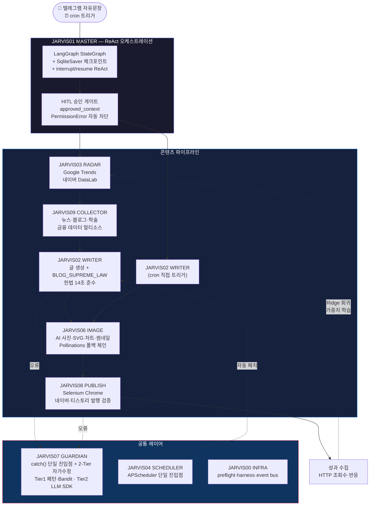
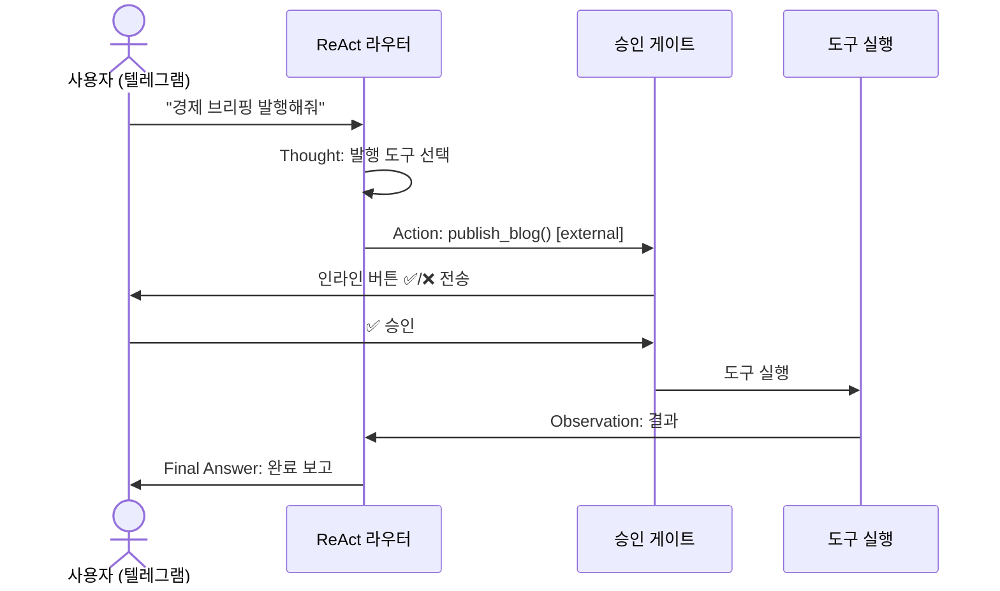
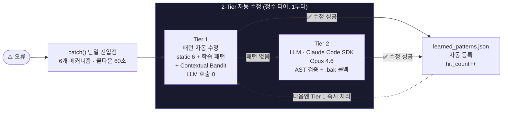
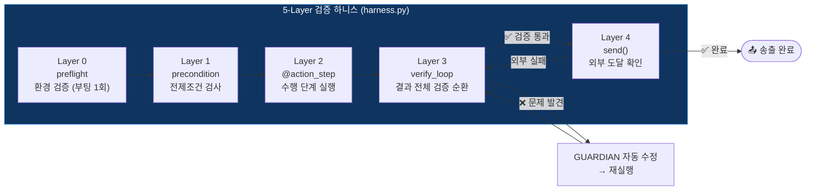
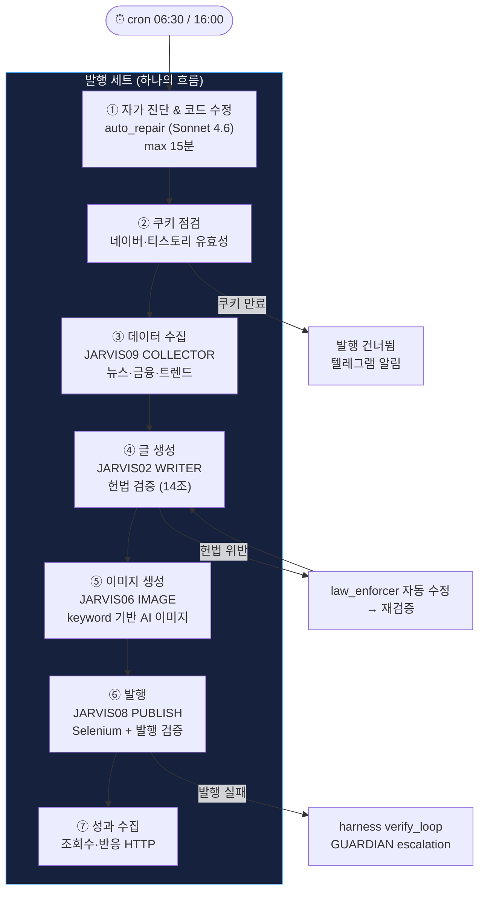
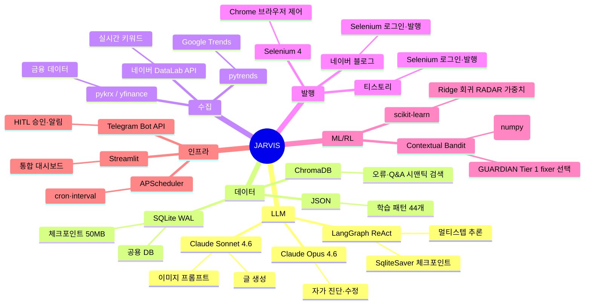

<div align="center">

# 📊 JARVIS Agent — 결과 & 기술 증명서

**트렌드 감지 → 수집 → 글 생성 → 이미지 → 네이버·티스토리 발행 → 성과 수집 → 자가 진단·수정·학습**  
전 과정이 단일 데몬 안에서 자율 동작하는 10-모듈 멀티에이전트 시스템

[](README.md#-팀--역할)
[](https://python.org)
[](https://anthropic.com)
[](https://langchain-ai.github.io/langgraph/)

</div>

---

## 1. 핵심 지표 요약

<div align="center">

| 지표 | 값 | 비고 |
|:----:|:--:|:----:|
| 🗂️ **에이전트 모듈** | **10개** | JARVIS00_INFRA ~ JARVIS09_COLLECTOR |
| 📝 **Python 코드** | **68,900 LOC** | 168개 파일 |
| 🔧 **ReAct 등록 도구** | **29개** | SAFE / APPROVAL 분류, 승인 게이트 |
| 🛡️ **거버넌스 검증** | **40종** | `precommit_check.py` 947줄 |
| 🧠 **학습 패턴 누적** | **44개** | 236회 적중 (LLM 호출 절감) |
| 📦 **체크포인트 DB** | **50 MB** | `react_checkpoints.sqlite` (실가동 증거) |
| 📋 **오류 기록** | **289건 / 5,981줄** | `ERRORS.md` 구조화 회고 |
| 💰 **LLM 외부 API 비용** | **₩0** | Claude Max OAuth — 별도 과금 없음 |

</div>

---

## 2. 시스템 아키텍처



---

## 3. 에이전트별 엔지니어링 하이라이트

### 🧠 JARVIS01 MASTER — ReAct 오케스트레이션 + HITL

| 구성요소 | 구현 | 파일 |
|---------|------|------|
| ReAct 루프 | LangGraph `StateGraph` + `SqliteSaver` 체크포인트 | `JARVIS01_MASTER/router.py` |
| HITL 승인 | `interrupt()` / `resume_react` — 텔레그램 ✅/❌ | `JARVIS01_MASTER/router.py` |
| 권한 차단 | `approved_context` 밖 external 도구 → `PermissionError` | `shared/tools.py` |
| 도구 거버넌스 | `@register_tool(side_effect·rollback·cost·requires_approval)` | `shared/tools.py` |
| 안전 박스 | `_safe_path` 3중 방어 + bash 화이트리스트 + 14패턴 deny | `JARVIS01_MASTER/agent_tools.py` |



---

### 🛡️ JARVIS07 GUARDIAN — catch() 단일 진입점 + 2-Tier 자가 학습 엔진



| 지표 | 값 |
|------|-----|
| 정적 패턴 Fixer 종류 | 6종 (상대 import·NoneType·NameError·ImportError 등) |
| 강화학습 | `Contextual Bandit (Linear UCB)` — fixer 선택을 성공/실패 보상으로 학습 |
| 자가 학습 안전망 | `.bak` 자동 백업 + `ast.parse` 검증 + 실패 시 롤백 |
| 누적 패턴 | **44개** · 총 적중 **236회** |
| eval 게이트 | `eval_agent` — 안전성·정확성·재사용가치 3축 채점 80+ 통과 분만 등록 |

---

### 🏛️ 검증 순환 하니스 (JARVIS00 INFRA)



> **불변식**: "결함 있는 결과물은 영원히 송출되지 않는다. 송출 = 완료."

---

### 📐 헌법형 거버넌스 (`precommit_check.py` 947줄)

| 검증 카테고리 | 내용 | 위반 차단 |
|-------------|------|---------|
| `infra` | JARVIS00 외 인프라 코드 정의 | ✅ |
| `length` | 분량 관련 상수 다른 파일 박기 | ✅ |
| `blog` | 블로그 정책 중복 정의 | ✅ |
| `schedule` | APScheduler 외부 생성·`schedule` 라이브러리 사용 | ✅ |
| `autocode` | 승인 게이트 우회 코드 | ✅ |
| `tools` | 도구 등록 외부 정의 | ✅ |
| `image` | Pollinations URL 직접 호출 | ✅ |
| `domain` | 도메인 책임 분산 | ✅ |

**3중 자동 실행**: git pre-commit hook + 데몬 부팅 + 주간 감사 잡

---

## 4. 발행 파이프라인 상세



---

## 5. 수집 → 이미지 파이프라인 (글-이미지 정합성)

| 단계 | 처리 | 담당 |
|------|------|------|
| 1️⃣ 주제 선정 | RADAR가 트렌드 키워드 선정 | JARVIS03 |
| 2️⃣ 주제별 수집 | `collect_for_theme(keyword)` — 주제에 맞는 뉴스·금융 데이터 | JARVIS09 |
| 3️⃣ 글 작성 | 수집 데이터 기반 본문 생성 (25문장 이상) | JARVIS02 |
| 4️⃣ 키워드 재수집 | 글 keyword로 JARVIS09 재수집 → 이미지용 팩트 확보 | JARVIS09 |
| 5️⃣ 이미지 생성 | `facts_for_chart(keyword=kw)` → keyword 필터 적용 차트 | JARVIS06 |
| 6️⃣ 캐시 초기화 | 글 세션 시작 시 `clear_session_cache()` 전 글 잔재 제거 | JARVIS06 |

> **글-이미지 정합성 보장**: 주제 `"금리 인상"` 글에 `"삼성전자 시가총액"` 데이터가 섞이지 않도록 keyword 필터로 도메인 오염 차단.

---

## 6. 기술 스택 상세



---

## 7. 운영 증거

| 증거 | 값 / 위치 | 의미 |
|------|---------|------|
| `react_checkpoints.sqlite` | **50 MB** | ReAct 라우터 실제 누적 가동 증거 |
| `JARVIS07_GUARDIAN/ERRORS.md` | **289건 / 5,981줄** | 운영 사고 구조화 회고 → 코드 환류 |
| RADAR 학습 루프 | 발행 → 성과 수집 → Ridge 회귀 → opportunity_score | 폐쇄 학습 루프 실증 |
| 자가 학습 LLM 절감 | 236회 패턴 적중 | 동일 오류 LLM 0 자동 처리 |

---

## 8. 팀 & 역할

**2인 팀 · 전 과정 페어 프로그래밍으로 공동 개발.**  
두 개발자가 **개발자(김효중) macOS 한 대에서 함께 작업**했습니다.  
git 커밋은 단일 계정(`youandi3535`)으로 기록되지만, 설계·구현 전 과정을 두 사람이 함께 진행했습니다.

| 멤버 | 역할 | 주력 도메인 | 담당 에이전트 |
|------|------|------------|-------------|
| **김효중** (HJ) | 주도 개발 · 아키텍처 · 신뢰성 코어 | 에이전트 플랫폼·거버넌스 | JARVIS00·01·04·07 · shared/ |
| **김나연** (NY) | 공동 개발 · 콘텐츠·수집·발행 파이프라인 | 블로그 자동화·트렌드·이미지 | JARVIS02·03·06·08·09 |

```
개발 환경:
  ┌──────────────────────────────────────────┐
  │          개발자 macOS (공유)              │
  │                                          │
  │  김효중 (HJ)          김나연 (NY)         │
  │  플랫폼·코어 담당  ←→  파이프라인 담당    │
  │                                          │
  │  git commit: youandi3535                 │
  │  (단일 계정 — 동일 macOS에서 공동 작업)   │
  └──────────────────────────────────────────┘
```

---

## 9. 한계 (정직 기록)

| 구분 | 내용 | 계획 |
|------|------|------|
| 🔴 `shared/tracing.py`·`shared/schemas.py` 커밋 누락 | 로컬엔 존재 (50MB 체크포인트가 가동 증명)하나 repo 미반영 → clone 시 ReAct import 에러 | 두 파일 커밋으로 재현성 복구 예정 |
| 🟡 테스트 커버리지 부족 | 핵심 경로(ReAct·harness·발행) 테스트 2개 | 보강 예정 |
| 🟡 발행 멱등성 미완 | 영구 "오늘 이미 발행" 가드 부재 | 티스토리 발행 검증 추가 예정 |
| 🟡 단일 macOS 의존 | GUI 자동화(Selenium) → 서버 환경 미지원 | 발행 워커 분리·컨테이너화 예정 |

---

## 10. 재현

개발은 2인이 개발자 macOS 한 대에서 페어 프로그래밍으로 함께 진행합니다.  
운영 데몬은 발행 사고·학습 자산 오염 방지를 위해 그 macOS 1곳에서만 상시 실행합니다.  
학습 자산(`learned_patterns.json` 등)·로그·체크포인트는 `.gitignore`로 제외(런타임 보관).

팀원 개발 환경 가이드 → [`README.dev.md`](README.dev.md) 참조.
